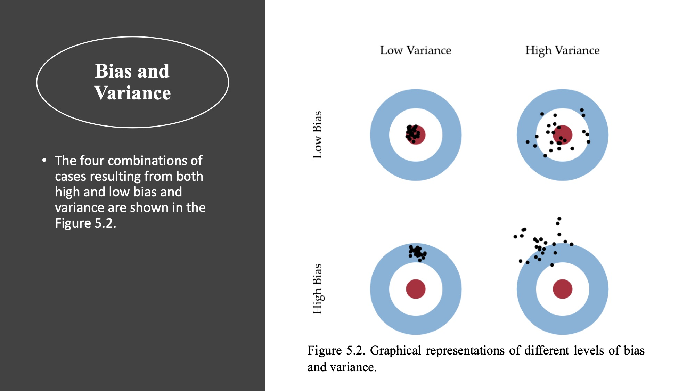

class: middle
##The problem of overfitting 

- Let's consider a model such as: $\mathbf{y} = f(\mathbf{x}) + \boldsymbol{\epsilon}.$

- The overfitting phenomenon occurs when the statistical learning model learns the training data set so well that it performs poorly on unseen datasets.

- Overfitting happens when a statistical learning model learns the systematic and noise (random fluctuations) parts in the training data to the extent that it negatively impacts the performance of the statistical learning model on new data.

- This means that the statistical learning model adapts very well to the noise as well as to the signal that is present in the training data.

- The problem is that affect the model’s ability to be generalized.

- Overfitting is more common when learning a loss function from a complex statistical learning model (with more flexibility).

**Source**: Material based on Mini-course: Machine Learning methods for genomic prediction written by Dr. Osval Antonio Montesinos López.

---
class: middle
##The problem of  underfitting

- On the other hand, the underfitted model occurs when few predictors are included in the statistical learning model (simple model) that poorly represents the complete picture of the predominant data pattern.

- This problem also arises when the training dataset is too small or not representative of the population data.

- An underfitted model does not do a good job for fitting the training data and for predicting new data points.

**Source**: Material based on Mini-course: Machine Learning methods for genomic prediction written by Dr. Osval Antonio Montesinos López.


---
class: middle
##The Bias-Variance Tradeoff

- Sometimes, we choose a model that is too simple to represent the underlying data generation process. 

- Other times, we choose a model that is too complex—it fits the noise in the data rather than the data's overall pattern.

- To understand why this happens, we analyze our models using the tools of probability and statistics. 

- These tools allow us to generalize beyond a few isolated examples to describe fundamental phenomena in modeling. In particular, we will use the tools of expectation and variance to uncover the bias-variance tradeoff.

[Reference:](https://www.textbook.ds100.org/ch/15/bias_intro.html)


---
class: middle
##The Bias-Variance Tradeoff - (Hedibert Lopes & Paulo Marques)

- Which coefficients do we set to 0?

- The key idea is the bias variance trade-off !!!

- If we set too many coefficients to 0, we may be throwing out some variables that do important work in explaining (Bias)

- If we keep too many variables, it may be difficult to get good estimates of all the corresponding coefficients (Variance)

[Source:](http://hedibert.org/wp-content/uploads/2018/05/multiplelinearregression.pdf)

---
class: middle
###Bias and Variance




**Source**: Material based on Mini-course: Machine Learning methods for genomic prediction written by Dr. Osval Antonio Montesinos López.

---
class: middle
###Bias 

Now, let's consider is the following model

$$\mathbf{y} = f(\mathbf{x}) + \boldsymbol{\epsilon}.$$

The bias of an estimator $\hat{\boldsymbol{\theta}}$  is given by

--
$$\mbox{Bias}(\hat{\boldsymbol{\theta}}) = E[\hat{\boldsymbol{\theta}}] - \boldsymbol{\theta}.$$

The bias of ${\hat{f}(\mathbf{x})}$ is the following

$$\mbox{Bias}(\hat{f}(\mathbf{x})) = E[\hat{f}(\mathbf{x})] - f(\mathbf{x}).$$

Note that $E[Y|X=x] = f(\mathbf{x})$ and $\hat{f}(\mathbf{x})$ is a function of $\hat{\theta}.$

[Source:](https://daviddalpiaz.github.io/r4sl/biasvariance-tradeoff.html)
---
class: middle
##Variance

The variance of an estimator $\hat{\theta}$ is

--
$$\mbox{Var}(\hat{\boldsymbol{\theta}}) = E[\hat{\boldsymbol{\theta}} -E[\hat{\boldsymbol{\theta}}]]^2.$$

The variance of an estimator $\hat{f}(\mathbf{x})$ is

--
$$\mbox{Var}(\hat{f}(\mathbf{x})) = E[\hat{f}(\mathbf{x}) -E[\hat{f}(\mathbf{x})]]^2.$$

[Source:](https://daviddalpiaz.github.io/r4sl/biasvariance-tradeoff.html)
---
class: middle
##Expected Prediction Error

--
$$\mbox{EPE}[Y, \hat{f}(\mathbf{x})]  = E[(Y - \hat{f}(\mathbf{x}))^2|\mathbf{X}=\mathbf{x}]$$

--
$$\mbox{EPE}[Y, \hat{f}(\mathbf{x})]= E[(Y - \hat{f}(\mathbf{x})  + f(\mathbf{x})  - f(\mathbf{x}) )^2|\mathbf{X}=\mathbf{x}]$$ 

Assuming $E[Y] = f(\mathbf{x}),$


--
$$\mbox{EPE}[Y, \hat{f}(\mathbf{x})]=E[(Y - f(\mathbf{x}))^2 |\mathbf{X}=\mathbf{x}] + E[(f(\mathbf{x})  - \hat{f}(\mathbf{x}) )^2|\mathbf{X}=\mathbf{x}]$$ 

--
$$\mbox{EPE}[Y, \hat{f}(\mathbf{x})]=Var[Y  |\mathbf{X}=\mathbf{x}] + E[(f(\mathbf{x})  - \hat{f}(\mathbf{x}) )^2|\mathbf{X}=\mathbf{x}]$$ 
where $E[(f(\mathbf{x})  - \hat{f}(\mathbf{x}) )^2|\mathbf{X}=\mathbf{x}]$ is called mean squared error of estimating $\hat{f}(\mathbf{x})$ or reducible error.

From this point, let's denotate mean squared error by $E[(f(\mathbf{x})  - \hat{f}(\mathbf{x}) )^2]$ without loss of the generality.

And let's assume $\mbox{Var}(Y|\mathbf{X}=\mathbf{x}) = \sigma^2$, sometimes called irreducible error.


[Source:](https://daviddalpiaz.github.io/r4sl/biasvariance-tradeoff.html)
---
class: middle
##Expected Prediction Error and Bias Variance Decompostion of mean squared error.


However,

--
$$E[(f(\mathbf{x})  - \hat{f}(\mathbf{x}) )^2] = E[(f(\mathbf{x})  - E[\hat{f}(\mathbf{x})] + E[\hat{f}(\mathbf{x})] - \hat{f}(\mathbf{x}) )^2]$$ 

--
$$E[(f(\mathbf{x})  - \hat{f}(\mathbf{x}) )^2] = E[(f(\mathbf{x})  - E[\hat{f}(\mathbf{x})]]^2 + E[(E[\hat{f}(\mathbf{x})] - \hat{f}(\mathbf{x}) )^2]$$ 

--
$$E[(f(\mathbf{x})  - \hat{f}(\mathbf{x}) )^2] = (E[\hat{f}(\mathbf{x})] - \hat{f}(\mathbf{x}) )^2 +  E[\hat{f}(\mathbf{x})  - E[\hat{f}(\mathbf{x})]]^2 $$ 


--
$$MSE(f(\mathbf{x}) , \hat{f}(\mathbf{x}) ) = Bias(\hat{f}(\mathbf{x}))^2 + Var(\hat{f}(\mathbf{x}))$$

Therefore,

--
$$EPE(Y,\hat{f}(\mathbf{x})  ) = Bias(\hat{f}(\mathbf{x}))^2 + Var(\hat{f}(\mathbf{x})) + Var(Y|\mathbf{X}=\mathbf{x})$$

[Source:](https://daviddalpiaz.github.io/r4sl/biasvariance-tradeoff.html)

---
class: middle
##Bias and Variance in Pratice


- In an ideal world, we would minimize the expected prediction error for our model over all input-output points in the population. 

- However, in practice, we do not know the population data generation process and thus are unable to precisely determine a model's bias, variance, or irreducible error. 

- Instead, we use our observed dataset as an approximation to the population.

- As we have seen, however, achieving a low training error does not necessarily mean that our model will have a low test error as well. 

[Reference:](https://www.textbook.ds100.org/ch/15/bias_intro.html)

---
class: middle
##Simulation

We will illustrate the bias-variance tradeoff, through simulation. Suppose we would like to train a model to learn the true regression function $f(x) =  x^2.$


The true model will be $Y|X \sim N(f(x),\sigma^2)$

And we are going to fit two models

- $$\hat{f}_1(x) = \beta_0$$

- $$\hat{f}_1(x) = \beta_0 + \beta_1 x + \beta_2 x^2 + \ldots + \beta_9 x^9.$$

Let's assume $\sigma^2=0.3.$


```{r, echo = FALSE,warning=FALSE, message=FALSE}

library(tidyverse)
library(ggpubr)

f = function(x) {
  x ^ 2
}

get_sim_data = function(f, sample_size = 100) {
  x = runif(n = sample_size, min = 0, max = 1)
  y = rnorm(n = sample_size, mean = f(x), sd = sqrt(0.3))
  data.frame(x, y)
}

set.seed(1)
sim_data = get_sim_data(f)


p1 = ggplot(sim_data,aes(x, y)) +
  stat_summary(fun.data=mean_cl_normal) + 
  geom_smooth(method='lm', formula= y ~ 1,se=FALSE)+theme_bw()

p2 = ggplot(sim_data,aes(x, y)) +
  stat_summary(fun.data=mean_cl_normal) + 
  geom_smooth(method='lm', formula= y ~ poly(x, degree = 9),se=FALSE)+theme_bw()

#ggarrange(p1,p2 , 
#          labels = c("linear", "nine degree"),
#          ncol = 1, nrow = 2)

```

---
class: middle
##Simulation - Variance of $\hat{f}(x)$


```{r, echo = FALSE,warning=FALSE, message=FALSE}

set.seed(2)
sim_data2 = get_sim_data(f)

set.seed(3)
sim_data3 = get_sim_data(f)

set.seed(4)
sim_data4 = get_sim_data(f)


p2.1 = ggplot(sim_data2,aes(x, y)) +
  stat_summary(fun.data=mean_cl_normal) + 
  geom_smooth(method='lm', formula= y ~ poly(x, degree = 9),se=FALSE)+theme_bw()

p3.1 = ggplot(sim_data3,aes(x, y)) +
  stat_summary(fun.data=mean_cl_normal) + 
  geom_smooth(method='lm', formula= y ~ poly(x, degree = 9),se=FALSE)+theme_bw()

p4.1 = ggplot(sim_data4,aes(x, y)) +
  stat_summary(fun.data=mean_cl_normal) + 
  geom_smooth(method='lm', formula= y ~ poly(x, degree = 9),se=FALSE)+theme_bw()

p2.2 = ggplot(sim_data2,aes(x, y)) +
  stat_summary(fun.data=mean_cl_normal) + 
  geom_smooth(method='lm', formula= y ~ 1,se=FALSE)+theme_bw()

p3.2 = ggplot(sim_data3,aes(x, y)) +
  stat_summary(fun.data=mean_cl_normal) + 
  geom_smooth(method='lm', formula= y ~1,se=FALSE)+theme_bw()

p4.2 = ggplot(sim_data4,aes(x, y)) +
  stat_summary(fun.data=mean_cl_normal) + 
  geom_smooth(method='lm', formula= y ~ 1,se=FALSE)+theme_bw()

ggarrange(p2.1,p2.2,
          p3.1,p3.2,
          p4.1,p4.2, 
          #labels = c("sample 1", "sample 2", "sample 3"),
          ncol = 2, nrow = 3)


```


---
class: middle
##Simulation


- We will now complete a simulation study to understand the relationship between the bias, variance, and mean squared error for the estimates for $f(x)$ given by these four models at the point $x=0.90$

- We use simulation to complete this task, as performing the analytical calculations would prove to be rather tedious and difficult.

---
class: middle
##Simulation


```{r, echo = FALSE,warning=FALSE, message=FALSE}

set.seed(1)
n_sims = 250
n_models = 4
x = data.frame(x = 0.90) # fixed point at which we make predictions
predictions = matrix(0, nrow = n_sims, ncol = n_models)

for (sim in 1:n_sims) {

  # simulate new, random, training data
  # this is the only random portion of the bias, var, and mse calculations
  # this allows us to calculate the expectation over D
  sim_data = get_sim_data(f)

  # fit models
  fit_0 = lm(y ~ 1,                   data = sim_data)
  fit_1 = lm(y ~ poly(x, degree = 1), data = sim_data)
  fit_2 = lm(y ~ poly(x, degree = 2), data = sim_data)
  fit_9 = lm(y ~ poly(x, degree = 9), data = sim_data)

  # get predictions
  predictions[sim, 1] = predict(fit_0, x)
  predictions[sim, 2] = predict(fit_1, x)
  predictions[sim, 3] = predict(fit_2, x)
  predictions[sim, 4] = predict(fit_9, x)
}

res = data.frame(
   degree= factor(rep(c(0,1,2,9),each=250)),
   predictions = c(predictions[,1],
                   predictions[,2],
                   predictions[,3],
                   predictions[,4]
                  )
  )

ggplot(res) +
geom_boxplot(aes(x=degree, y=predictions,fill=degree))+theme_bw()+
geom_hline(yintercept=0.81)

```


---
class: middle
##Key Findings from Simulation

Two things are immediately clear:

- As complexity increases, **bias decreases**. (The mean of a model’s predictions is closer to the truth.)
- As complexity increases, **variance increases**. (The variance about the mean of a model’s predictions increases.)


---
class: middle
##Bias and Variance in Pratice


- It is easy to obtain a model with extremely low bias and therefore low training error by fitting a curve that passes through every training observation. 

- However, this model will have high variance which typically leads to high test error. 

- Conversely, a model that predicts a constant has low variance but high bias. Fundamentally, this occurs because training error reflects the bias of our model but not the variance; the test error reflects both. 

- In order to minimize test error, our model needs to simultaneously achieve low bias and low variance. To account for this, we need a way to simulate test error without using the test set. This is generally done using cross validation.

[Reference:](https://www.textbook.ds100.org/ch/15/bias_intro.html)

---
class: middle
###The trade-off between prediction accuracy and model interpretability

- Accuracy: It is the ability of a statistical learning model to make correct predictions of unseen data.

- Flexible models: These are complex models (SVM, ANN, etc.) which are better in terms of prediction accuracy, but are not interpretable. 

- Inflexible models. These are simple models (linear regression) are very interpretable but worse in terms of accuracy.

**Source**: Material based on Mini-course: Machine Learning methods for genomic prediction written by Dr. Osval Antonio Montesinos López.

---
class: middle
##Takeaways 

- The bias-variance tradeoff allows us to more precisely describe the modeling phenomena that we have seen thus far.

- Underfitting is typically caused by too much bias; overfitting is typically caused by too much model variance.

- Collecting more data reduces variance. For example, the model variance of linear regression goes down by a factor of  $\frac{1}{n}$, where $n$  is the number of data points. 

- Thus, doubling the dataset size halves the model variance, and collecting many data points will cause the variance to approach 0. 

[Reference:](https://www.textbook.ds100.org/ch/15/bias_intro.html)


---
class: middle
##Takeaways 


- One recent trend is to select a model with low bias and high intrinsic variance (e.g. a neural network) and collect many data points so that the model variance is low enough to make accurate predictions. 

- While effective in practice, collecting enough data for these models tends to require large amounts of time and money.

- Collecting more data reduces bias if the model can fit the population process exactly. If the model is inherently incapable of modeling the population (as in the example above), even infinite data cannot get rid of model bias.

- Adding a useful feature to the data, such as a quadratic feature when the underlying process is quadratic, reduces bias. Adding a useless feature rarely increases bias.

[Reference:](https://www.textbook.ds100.org/ch/15/bias_intro.html)


