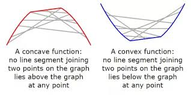
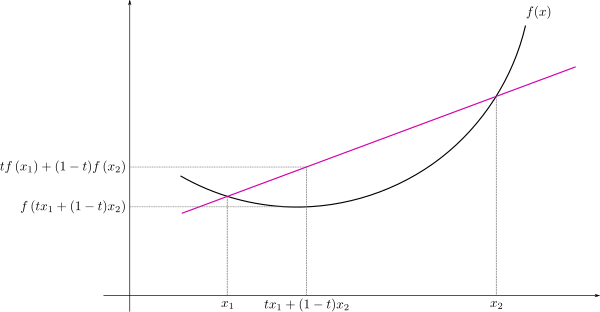
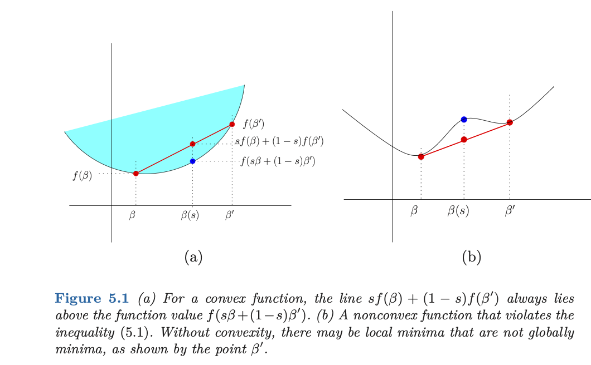
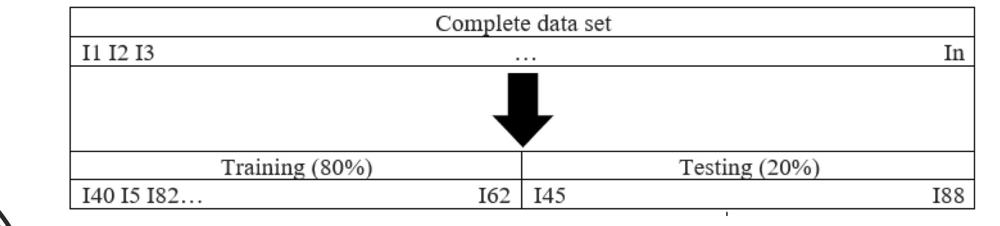
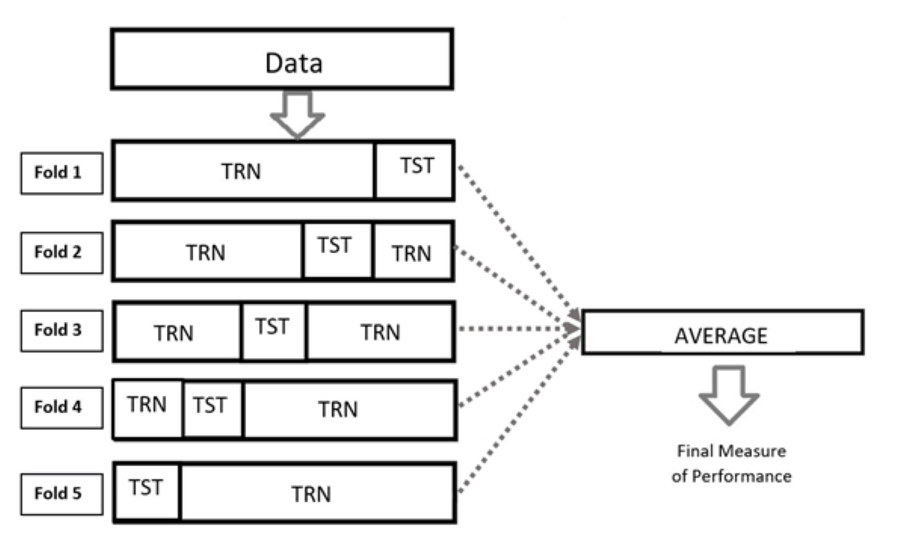

class: middle
##Gradient Descent Method

- Before presenting the shrinkage methods itself, we are going to show another way to estimate parameter in a regression model.

- The method is called gradient descent.

- It can be useful for large datasets.

---
class: middle
##Concave and convex functions of a single variable

- The concept  of concavity and convexity are  central to optimization theory.

###Definition

- Let $f$ be a function of a single variable defined on an interval. 

Then $f$ is 

- **concave** if every line segment joining two points on its graph is never above the graph.

- **convex** if every line segment joining two points on its graph is never below the graph.

[Source:](https://mjo.osborne.economics.utoronto.ca/index.php/tutorial/index/1/cv1/t#:~:text=A%20function%20of%20a%20single,the%20graph%20at%20any%20point.)

---
class: middle
##Concave and convex functions of a single variable





---
class: middle
##Convex functions of a single variable





---
class: middle
##Concave and convex functions of a single variable


###Definition

Let $f$ be a function of a single variable defined on the interval $I$. Then $f$ is


- convex if for all $x_1 \in I$, all $x_2 \in I$, and all $t \in (0, 1)$ we have
$f(tx_1 + (1−t)x_2)	 \leq tf(x_1) +	(1 − t)f(x_2).$

Note that

$$\forall x_1, x_2 \in C: f\left(\frac{x_1+x_2}{2}\right) \leq \frac{f(x_1)+f(x_2)}{2}.$$


---
class: middle

##Differentiable Function

- In calculus, a differentiable function of one real variable is a function whose derivative exists at each point in its domain. 

- As a result, the graph of a differentiable function must have a (non-vertical) tangent line at each interior point in its domain, be relatively smooth, and cannot contain any break, angle, or cusp.

[Source](https://en.wikipedia.org/wiki/Differentiable_function)


---
class: middle

##Convex Optimality Conditions

- An important class of optmization problems involves convex 
cost functions and convex constraints. 

$$f(\boldsymbol{\beta}(s)) = f(s\boldsymbol{\beta} + (1-s)\boldsymbol{\beta}^{'}) \leq sf(\boldsymbol{\beta}) + 
(1-s)\boldsymbol{\beta}^{'}.$$

- **This inequality guarantees that a convex 
function cannot have any local minima that are not also 
globally minimal**.


---
class: middle
##Convex Optimality Condition





---
class: middle
##Unconstrained Gradient Descent Method

- Let's consider a convex differentiable $f: \mathbb{R} \Rightarrow \mathbb{R}^p.$

- In this case, assuming that a global minimum is achieved, then a necessary and sufficient condition for optimally of $\boldsymbol{\beta} \in \mathbb{R}$ is provided by the zero-gradient condition $\nabla f(\boldsymbol{\beta}^{*}) = 0.$

- Gradient descent is an iterative algorithm for solving this fixed point equation: it generates a sequence of iteratives $\left\{\boldsymbol{\beta}^{t} \right\}^{\infty}_{t=0}$ via update

$$\boldsymbol{\beta}^{t+1} = \boldsymbol{\beta}^t - s \nabla f(\boldsymbol{\beta}^t), \phantom{1111} \mbox{for} \phantom{11} t=0,1,2,\ldots$$ 
where $s > 0$ is a stepsize parameter.

[Source:](https://web.stanford.edu/~hastie/StatLearnSparsity/)
---
class: middle
##Unconstrained Gradient Descent Method - Simple Linear Regression

Let's suppose the following model:

$$\mathbf{y} = \mathbf{X}\boldsymbol{\beta} + \boldsymbol{\epsilon}$$
Our goal is estimate the values of $\boldsymbol{\beta}$

The mean squared function is given by

$$MSE(\beta_0, \beta_1) = \frac{1}{n}(\mathbf{y} - \mathbf{X}\boldsymbol{\beta})^{'}(\mathbf{y} - \mathbf{X}\boldsymbol{\beta})$$
The estimates are obtained by minimizing the mean squared error function.

---
class: middle
##Unconstrained Gradient Descent Method - Linear Regression

The gradient of this function is the following

--
$$\frac{\partial MSE(\boldsymbol{\beta})}{\partial \boldsymbol{\beta}} = -\frac{2}{n}\mathbf{X}^{'}(\mathbf{y} - \mathbf{X}\boldsymbol{\beta})$$
The gradient descent can be applied as follows

--
$$\frac{\partial MSE(\boldsymbol{\beta})}{\partial \boldsymbol{\beta}} = -\frac{2}{n}\mathbf{X}^{'}(\mathbf{y} - \mathbf{X}\boldsymbol{\beta})$$
The gradient descent can be applied as follows


--
$$\boldsymbol{\beta}^{t+1} := \boldsymbol{\beta}^t - \frac{2}{n}s \mathbf{X}^{'}(\mathbf{X}\boldsymbol{\beta}-\mathbf{y})$$
for $s > 0.$

---
class: middle
##Example Prostate - Cancer (lspa ~ lcavol)


```{r, message=FALSE, warning=FALSE, echo = FALSE}
library(tidyverse)
library(broom)
dat = read.table("http://statweb.stanford.edu/~tibs/ElemStatLearn/datasets/prostate.data")

```


```{r, message=FALSE, warning=FALSE}
x = dat$lcavol
X = cbind(1,x)
N = nrow(X)
y = dat$lpsa
s=0.0001
iters=1000000
beta_coef = cbind(c(1,1))
for(i in 1:iters){
  beta_coef = beta_coef - (2/N)*s*t(X)%*%(X%*%beta_coef-y)
}

beta_coef

```


[Source:](https://www.ocf.berkeley.edu/~janastas/stochastic-gradient-descent-in-r.html)

---
class: middle
##Example Prostate - Cancer (lspa ~ lcavol)

```{r, message=FALSE, warning=FALSE}

coef(lm(y ~ x))

```


---
class: middle
##Unconstrained Gradient Descent Method - Simple Logistic Regression

Let's suppose 

$$\pi( \mathbf{x}_i, \boldsymbol{\beta}) = \frac{1}{1 + \exp\left\{ -\mathbf{X}\boldsymbol{\beta}\right\}}$$

Mathematically, the cost function is proportional to minus log likelihood.

The cost function is given by

$$Cost(\boldsymbol{\beta}) = \frac{1}{n}\sum_{i=1}^{n}-y_i \log(\pi( \mathbf{x}_i, \boldsymbol{\beta})) - (1 - y_i)\log(1-\pi( \mathbf{x}_i, \boldsymbol{\beta}))$$

--
$$Cost(\boldsymbol{\beta}) =\frac{1}{n} \sum_{i=1}^n\left\{-y_i\boldsymbol{\beta}^{'}\mathbf{x}_i + \log(1 + e^{\boldsymbol{\beta}^{'}\mathbf{x}_i}) \right\},$$

---
class: middle
##Unconstrained Gradient Descent Method -  Logistic Regression


The gradient is the following

--
$$\frac{\partial Cost(\boldsymbol{\beta})}{\partial\boldsymbol{\beta}} =-\frac{1}{n}\mathbf{X}^{'}(\mathbf{y} - \mathbf{p})$$ 
where $\mathbf{p} = \left[ \pi(x_1;\boldsymbol{\beta}), \ldots,  \pi(x_n;\boldsymbol{\beta}) \right]$.


The gradient descent can be applied as follows

--
$$\boldsymbol{\beta}^{t+1} := \boldsymbol{\beta}^t -\frac{1}{n}\mathbf{X}^{'}(\mathbf{p} - \mathbf{y})$$


---
class: middle
##Example  South Africa (chd ~ tobacco)


```{r, message=FALSE, warning=FALSE, echo = FALSE}
dados = read.table("http://www-stat.stanford.edu/~tibs/ElemStatLearn/datasets/SAheart.data", sep=",",head=T,row.names=1)


```


```{r, message=FALSE, warning=FALSE}
x = dados$tobacco
X = cbind(1,x)
N = nrow(X)
y = dados$chd
s=0.0001
iters=1000000
beta_coef = cbind(c(1,1))
for(i in 1:iters){
  p_coef = 1 / (1  + exp(-X%*%beta_coef))
  beta_coef = beta_coef - (1/N)*s*t(X)%*%(p_coef-y)
}

beta_coef

```
---
class: middle
##Example  South Africa (chd ~ tobacco)


```{r, message=FALSE, warning=FALSE}
mod_simple = glm(chd~ tobacco, data = dados, family=binomial(link="logit"))

coef(mod_simple)

```


---
class: middle
## Regularized Linear Regression (Ridge Regression) - Least Square Approach


Let's suppose the following model: $\mathbf{y} = \mathbf{X}\boldsymbol{\beta} +\boldsymbol{\epsilon}$ where $\mathbf{X}$ is the centered matrix, i.e. $x_{ij} = \tilde{x}_{ij} - \bar{x}$. Consequently, $\hat{\beta}_0 = \frac{1}{n}\sum_{i=1}^ny_{i}$. The remaining coefficients get estimated by a ridge regression without intercept, 

The Penalized Sum Squared Error is given by

--
$$SSE(\boldsymbol{\beta}) = (\mathbf{y} - \mathbf{X}\boldsymbol{\beta})^{'}(\mathbf{y} - \mathbf{X}\boldsymbol{\beta}) - \lambda \boldsymbol{\beta}^{'}\boldsymbol{\beta}$$

--
$$SSE(\boldsymbol{\beta}) = \mathbf{y}^{'}\mathbf{y} - 2\mathbf{X}^{'}\boldsymbol{\beta}^{'}\mathbf{y} + \boldsymbol{\beta}^{'}\mathbf{X}^{'}\mathbf{X}\boldsymbol{\beta} - \lambda\boldsymbol{\beta}^{'}\boldsymbol{\beta}$$

--
$$\frac{\partial SSE(\boldsymbol{\beta}) }{\partial \boldsymbol{\beta}} = 2\mathbf{X}^{'}\mathbf{y} +2\mathbf{X}^{'}\mathbf{X}\boldsymbol{\beta} + 2\lambda\mathbf{I}\boldsymbol{\beta}$$

--
Making $\frac{\partial MSE(\boldsymbol{\beta}) }{\partial \boldsymbol{\beta}} = \mathbf{0}$, we have

--
$$(\mathbf{X}^{'}\mathbf{X} + \lambda \mathbf{I})\boldsymbol{\beta} = \mathbf{X}^{'}\mathbf{y} \Rightarrow \hat{\boldsymbol{\beta}} =  (\mathbf{X}^{'}\mathbf{X} + \lambda \mathbf{I})^{-1}\mathbf{X}^{'}\mathbf{y}$$

--
$$E[\hat{\boldsymbol{\beta}}] = (\mathbf{X}^{'}\mathbf{X} + \lambda \mathbf{I})^{-1}\mathbf{X}^{'}\boldsymbol{\beta}.$$


---
class: middle
## Regularized Linear Regression (Ridge Regression) in R


```{r, warning = FALSE, message=FALSE, eval= FALSE}
library(glmnet)


# Getting the independent variable
nam = c( "lcavol",  "lweight", "age",     "lbph",    "svi",     "lcp",     "gleason","pgg45", "train" )
x_var <- as.matrix(select(dat,one_of(nam)))
# Getting the dependent variable
y_var = dat$lpsa 
# Using glmnet function to build the ridge regression in r
fit1 <- glmnet(x_var, y_var, alpha = 0, lambda=c(0.001))
fit2 <- glmnet(x_var, y_var, alpha = 0, lambda=c(1000))              
data.frame(nam = c("(Intercept)",nam),
           fit1 = round(as.vector(coef(fit1)),3),
           fit2 = round(as.vector(coef(fit2)),3))


```

---
class: middle
## Regularized Linear Regression (Ridge Regression) using glmnet package


```{r, warning = FALSE, message=FALSE, echo= FALSE}
library(glmnet)


# Getting the independent variable
nam = c( "lcavol",  "lweight", "age",     "lbph",    "svi",     "lcp",     "gleason","pgg45", "train" )
x_var <- as.matrix(select(dat,one_of(nam)))
# Getting the dependent variable
y_var = dat$lpsa 
# Using glmnet function to build the ridge regression in r
fit1 <- glmnet(x_var, y_var, alpha = 0, lambda=c(0.001))
fit2 <- glmnet(x_var, y_var, alpha = 0, lambda=c(1000))              
data.frame(nam = c("(Intercept)",nam),
           fit1 = round(as.vector(coef(fit1)),3),
           fit2 = round(as.vector(coef(fit2)),3))


#Ordinary Least Square
#coef(glmnet(x_var, y_var, alpha = 0, lambda=c(0), standardize = FALSE))


```

---
class: middle

##Cross-validation

- Cross-validation (CV) is a strategy for model selection or algorithm selection.

- CV consists of splitting the data (at least once) for estimating the error of each algorithm.

- Part of the data (the training set) is used for training each algorithm, and the remaining part (the testing set) is used for estimating the error of the algorithm.

- Then, CV selects the algorithm with the smallest estimated error in new data.


---
class: middle

##Cross-validation - Single hold-out set approach

-  The single hold-out set or validation set approach consists of randomly dividing the available data set into a training set and a validation set.


-  One problem of the hold-out (validation) set approach is that it depends on just one training-testing split and its performance depends on how the data are split into the training and testing sets.


---
class: middle

##Cross-validation - Single hold-out set approach





---
class: middle

##Cross-validation - The k-fold cross-validation

- In k-fold CV, the data set is randomly divided into $k$ complementary folds (groups) of approximately equal size. One of the subsets is used as testing data and the rest $(k-1)$ as training data.

- Then $k-1$ folds are used for training the statistical learning model and the remaining fold for evaluating the out of sample prediction performance.

- This method is very accurate because it combines $k$ measures of fitness resulting from the k training and testing data sets into which the original data set was divided, but at the cost of more computational resources.

- In practice, the choice of the number of folds depends on the measurement of the data set, although 5 or 10 folds are the most common choices.


---
class: middle

##Cross-validation - The k-fold cross-validation




- It is important to point out that to reduce variability, we recommend implementing the **k-fold CV s times**.

- But each time using different complementary 
subsets to form the folds.


---
class: middle 

##Choosing Optimal $\lambda$ value using `glmnet`

The `cv.glmnet` function does k-fold cross-validation for glmnet, 
produces a plot, and returns a value for lambda

```{r,eval=FALSE}
cvfit = cv.glmnet(x_var, y_var, alpha=0)
plot(cvfit)

```


[Source:](https://web.stanford.edu/~hastie/glmnet/glmnet_alpha.html)


---
class: middle 

##Choosing Optimal $\lambda$ value using `glmnet`

```{r,echo=FALSE}
cvfit = cv.glmnet(x_var, y_var, alpha=0)
plot(cvfit)

```


---
class: middle 

##Choosing Optimal $\lambda$ value using `glmnet`

```{r,eval=FALSE}
coef(cvfit, s = "lambda.min")
```

####Output:

`lambda.min`:	value of lambda that gives minimum cvm.

`lambda.1se`:	largest value of lambda such that error is within 1 standard error of the minimum.

---
class: middle 

##Choosing Optimal $\lambda$ value using `glmnet`

`lambda.min`:

```{r,echo=FALSE}

cvfit$lambda.min

```


####Results 

```{r,echo=FALSE}

coef(cvfit, s = "lambda.min")

```

---
class: middle 

##Predicted Values 


```{r,eval=FALSE}

predict(cvfit, s = "lambda.min")

```


---
class: middle 

##Predicted Values 


```{r,echo=FALSE}

head(predict(cvfit, newx = x_var, s = "lambda.min"))

```