class: middle
##Introduction

- In the linear regression setting, we are given $N$ samples 
$\left\{(x_i, y_i)\right\}^{N}_{i=1}$, where each 
$x_i = \left(x_{i1}, \ldots, x_{ip} \right)$.

- Our goal is to approximate the response variable $y_i$ using a linear combination of the predictors:

$$\eta(x_i) = \beta_0 + \sum_{j=1}^p x_{ij}\beta_j.$$

The ordinary least square method is based on minimizing sum squared error

$$\displaystyle_{\mbox{minimize}_{\beta_0, \beta_1, \ldots, \beta_p}}\left\{ \sum_{i=1}^N(y_i - \beta_0 - \sum_{j=1}^p x_{ij}\beta_j)^2 \right\}.$$

In other words, the ordinary least square method is a **unconstrained minimization problem**.

---
class: middle
##The Lasso Estimator

- Given a collection of $N$ predictor-response pairs $\left\{(x_i,y_i)\right\}^{N}_{i=1},$ the lasso finds the solution $(\hat{\beta}_0, \hat{\beta}_1, \ldots, \hat{\beta}_p)$ to the optimization problem

--
$$\displaystyle_{\mbox{minimize}_{\beta_0, \beta_1, \ldots, \beta_p}}\left\{ \frac{1}{2N}\sum_{i=1}^N(y_i - \beta_0 - \sum_{j=1}^p x_{ij}\beta_j)^2 \right\}.$$

--
$$\mbox{subject to} \sum_{j=1}^p |\beta_j| \leq t.$$

---
class: middle
##The Lasso Estimator

In a form matrix

--
$$\displaystyle_{\mbox{minimize}_{\beta_0, \boldsymbol{\beta}}}\left\{ \frac{1}{2N}||\mathbf{y} - \beta_0\mathbf{1} - \mathbf{X}\boldsymbol{\beta}||^{2}_{2} \right\}.$$

$$\mbox{subject to} |\boldsymbol{\beta}|_1 \leq t.$$

---
class: middle
##The lasso Estimator

- Typically, we first standardize the predictors $\mathbf{X}$ so that each column is centered $(\frac{1}{N}\sum_{i=1}^N x_{ij} = 0)$ and has unit variance $(\frac{1}{N}\sum_{i=1}^N x_{ij}^2 = 1)$. 

- Without standardization, the lasso solutions would depend on units used to measure the predictors.

- On the other hand, we typically would not standardize if the features were measured in the same units.

---
class: middle
##The lasso Estimator

- For convenience, we also assume that the outcome values $y_i$ have been centered, meaning that $\frac{1}{N}\sum_{i=1}^N y_i = 0.$

- The centering conditions are convenient, since they mean that we can omit the intercept term $\beta_0$, in the lasso optmization.

- Given an optimal lasso solution $\boldsymbol{\beta}$ on the centered data, we can recover the optimal solutions for the uncentered data: $\hat{\beta}$ is the same, and the intercept $\hat{\beta}_0$ is given by

$$\hat{\beta}_0 = \bar{y} - \sum_{j=1}^p \bar{x}\hat{\beta}_j.$$
where $\bar{y}$ and $\left\{ \bar{x}_j\right\}^p_1$ are the original means.

For this reason, we omit the intercept from the lasso for the remainder of this lecture.


---
class: middle
##The lasso Estimator

- It is often convenient to rewrite the lasso problem is the so-called Lagrangian form

$$\displaystyle_{\mbox{minimize}_{\boldsymbol{\beta} \in \mathbb{R}^p}}\left\{ \frac{1}{2N}||\mathbf{y} -  \mathbf{X}\boldsymbol{\beta}||^{2}_{2} + \lambda ||\boldsymbol{\beta}||_1 \right\},$$
for some $\lambda \geq 0.$

- There is a one-to-one correspondence between the constrained problem and the Lagrangian form.

- For each value of $t$ in the range where the  constraint $||\boldsymbol{\beta}||_1 \leq t$  is active, there is a corresponding value of  $\lambda$ that yields the same solution from the Lagrangian form.

- Conversely, the solution $\hat{\beta}_{\lambda}$ 
to problem solves the bound problem with  $t = ||\hat{\beta}_{\lambda}||_1.$


---
class: middle
##The lasso Estimator

In summary: 

- The lasso estimator is a  **convex optimization problem**.

- A convex optimization problem consists of **minimizing a convex function** where **all** of the **constraints** are **convex functions** (more details latter).

- In the case of the **lasso estimator**, the **constraints functions** are **convex** but **non-differentiable**.


---
class: middle
##Convex sets 

####Definition

A set $C$ is called **convex** if

$$\mathbf{x},\mathbf{y} \in C \Rightarrow 
t\mathbf{x}+(1-t)\mathbf{y} \in C, \phantom{11} 
\forall t \in [0,1],$$

i.e, a set $C$ is convex if the line segment between any two points in $C$ lies in $C.$


[Convex Sets](https://www.youtube.com/watch?v=a_gRfwHUlhQ)


---
class: middle
##Convex Sets


####A convex set and non-convex set

---
class: middle

##Hyperplanes and halfspaces

.pull-left[

- A **hyperplane** is a set of the form 
$\left\{ \mathbf{x} | \mathbf{a}^{'}\mathbf{x} = \mathbf{b} \right\},$

- A **hyperplane** divides $\mathbb{R}^n$ into two 
**halfspaces.**

- A (closed) halfspaces is a set of the form $\left\{ \mathbf{x} | \mathbf{a}^{'}\mathbf{x} \leq \mathbf{b} \right\},$

]


.pull-right[

.center[
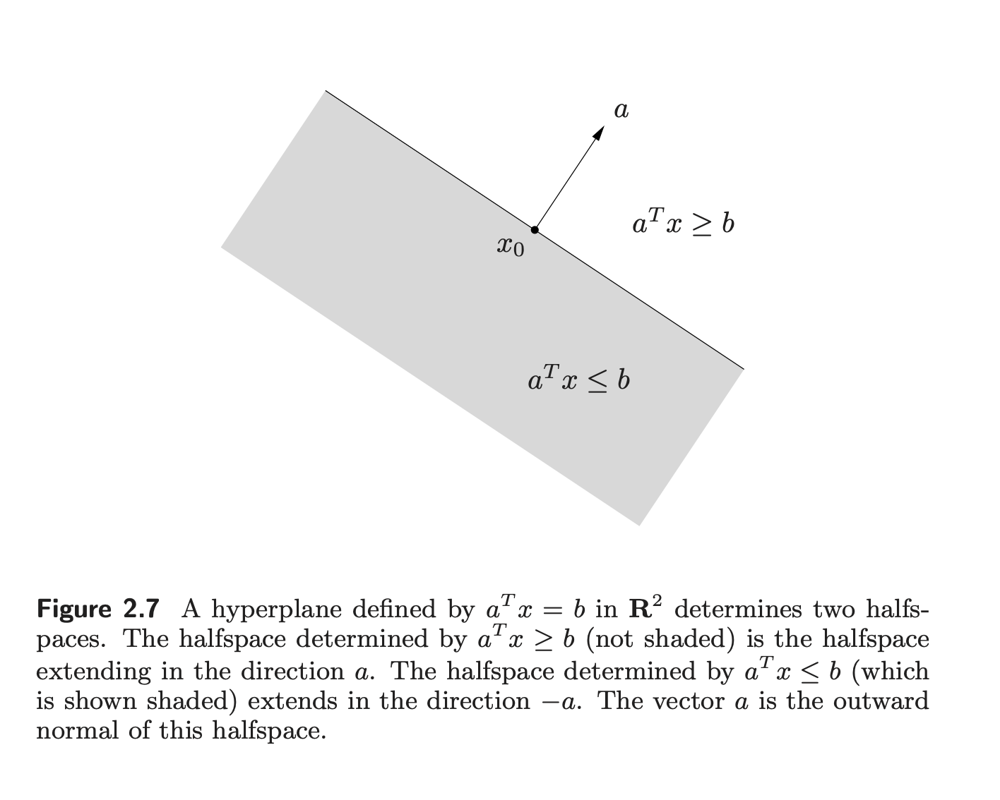

]

[Source](https://web.stanford.edu/~boyd/cvxbook/bv_cvxbook.pdf#page=83)


]

---
class: middle

##Supporting hyperplane

.center[
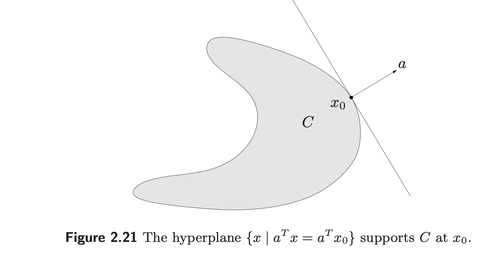

]


The geometric interpretation is that the hyperplane $\left\{\mathbf{x} | \mathbf{a}^{'}\mathbf{x} = \mathbf{a}^{'}\mathbf{x}_0 \right\}$ is tangent to $C$ at 
$\mathbf{x}_0,$ and the halfspace $\left\{\mathbf{x} | \mathbf{a}^{'}\mathbf{x} \leq \mathbf{a}^{'}\mathbf{x}_0 \right\}$ contains $C.$

[Source](https://web.stanford.edu/~boyd/cvxbook/bv_cvxbook.pdf#page=83)


---
class: middle
##Convex functions 

####Definition

A function $f: \mathbb{R}^{n} \Rightarrow \mathbb{R}$ is **convex** if dom $f$ is a convex set and if for all $\mathbf{x}$, $\mathbf{y}$, and $t$ with $0 \leq 1.$

$$f(t\mathbf{x} + (1-t)\mathbf{y}) \leq
tf(\mathbf{x}) + (1-t)f(\mathbf{y}).$$


[Source](https://web.stanford.edu/~boyd/cvxbook/bv_cvxbook.pdf#page=83)


---
class: middle
##Example: Convex function of a single variable


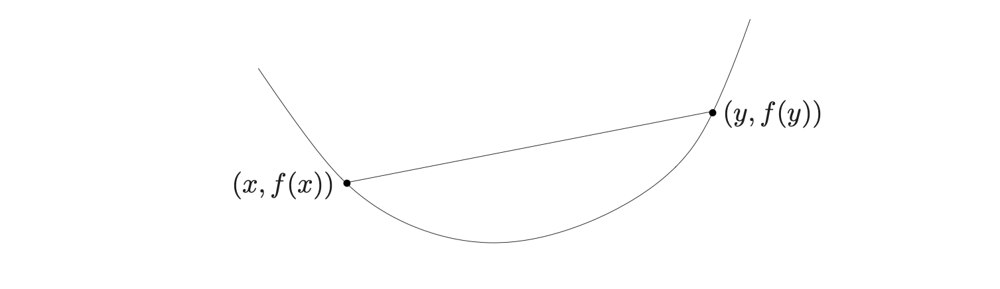


- Geometrically, this inequality means that the line segment
between $(x, f(x))$ and $(y, f(y)),$ which is the chord from $x$ to $y$, lies above the graph of $f.$

[Source](https://web.stanford.edu/~boyd/cvxbook/bv_cvxbook.pdf#page=83)

---
class: middle
##Examples - Convex functions

- affine: $ax+b$ (affine functions are both convex and concave)

- exponential: $e^{\alpha x}$, for any $\alpha \in \mathbb{R}$

- powers $x^a,$ for $a \geq 1$ or $a \leq 0$
- powers $-x^a$ for $0 \leq a \leq 1$

- powers of absolute value: $|x|^p$ , for $p \geq 1.$

- All norms are convex $||\mathbf{x}||^p = \left(\sum_{i=1}^n |x_i|^p\right)^{\frac{1}{p}},$
for all $p \geq 1.$

---
class: middle

##First-order conditions

- Let's suppose $f$ is differentiable (i.e, its gradient $\nabla f$ exists at each point in **dom**).

- Then $f$ is convex if and only if **dom** $f$ is convex and

$$f(\mathbf{y}) \geq f(\mathbf{x}) + \nabla f(\mathbf{x})^{'}(\mathbf{y} - \mathbf{x}).$$
holds for all $\mathbf{x},\mathbf{y} \in$ **dom** $f.$

---
class: middle
##First-order conditions - Function with a single variable

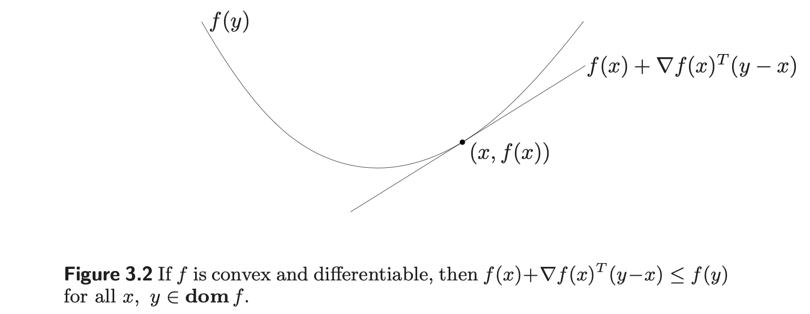

[Source](https://web.stanford.edu/~boyd/cvxbook/bv_cvxbook.pdf#page=83)

---
class: middle
##First-order conditions

- This is perhaps the most important property of convex functions, and explains some of the remarkable properties of convex functions and convex optimization problems.

- The function of $\mathbf{y}$ given by $f(\mathbf{x}) + \nabla f(\mathbf{x})^{'}(\mathbf{y} - \mathbf{x})$ is the **first-order Taylor approximation** of $f$ near $\mathbf{x}.$ 


- The inequality  states that for a convex function, the **first-order Taylor approximation** is in fact a **global underestimator** of the function. 


- Conversely, if the **first-order Taylor approximation** of a function **is always a global underestimator** of the function, **then the function is convex**.


---
class: middle
##First-order conditions

- The inequality  shows that from local information about a convex function (i.e., its value and derivative at a point) we can derive global information (i.e., a global underestimator of it). 

 As one simple example, the inequality shows that if $\nabla f(\mathbf{x}) = \mathbf{0}$, then for all $\mathbf{y} \in$ **dom** $f$, $f(\mathbf{y}) \geq f(\mathbf{x})$, i.e., x is a global minimizer of the function $f.$

---
class: middle
##Second-order conditions

Let's assume $f$ is twice differentiable, that is, its Hessian $\nabla^2 f$ exists at each point in **dom** $f$.

Then $f$ is convex if and only if **dom** is convex
and its Hessian is positive semidefinite: for all $\mathbf{x} \in$ **dom** $f,$ $\nabla^2 f \succeq \mathbf{0}.$


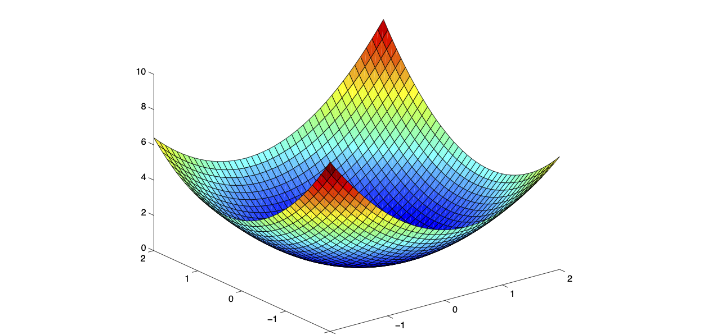


---
class: middle
##Epigraph

.pull-left[

####Definition

The **epigraph** of a function $f$ is the set of points

- $$\mbox{epi} f = \left\{ (x,t): f(x) \leq t \right\}$$

- $\mbox{epi} f$ is convex if and only if is convex.


]

.pull-right[

.center[
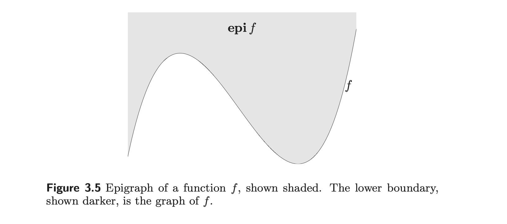

]


[Source](https://web.stanford.edu/~boyd/cvxbook/bv_cvxbook.pdf#page=83)

]

---
class: middle
##Sublevel sets


.pull-left[


- The $\alpha$ sublevel set of a function
$f: \mathbb{R}^n \Rightarrow \mathbb{R}$ 
is defined as

$$C_\alpha = \left\{ \mathbf{x} \in \mbox{dom}| f(\mathbf{x}) \leq \alpha \right\}.$$
]

.pull-right[

.center[
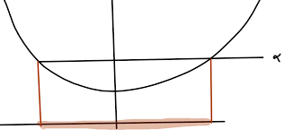

]

[Source](https://web.stanford.edu/~boyd/cvxbook/bv_cvxbook.pdf#page=83)


]

---
class: middle

##Convex Optimization Problems 

###Definition

An optimization problem is **convex** if its objective
is a convex function, the inequality constraints $g_j$
are convex, and the equality contraints $h_j$ are affine

\begin{align}
&&\mbox{minimize}_{\mathbf{x} \in \mathbb{R}^p}f(\mathbf{x}) \\
&&\mbox{s.t}\phantom{11} g_j(\mathbf{x}) \leq \mathbf{0} \phantom{11} j=1,\ldots, m\\
&& h_k(\mathbf{x}) = \mathbf{0}\phantom{11} k=1,\ldots, l
\end{align}

####Theorem 

If $\tilde{\mathbf{x}}$ is a **local minimizer of a convex optimization problem**, it is a **global minimizer**.

You can see the proof for that [in](https://web.stanford.edu/~boyd/cvxbook/bv_cvxbook.pdf#page=83), p.138. 

---
class: middle

##An optimally criterion for differentiable $f$

Suppose that the objective function $f$ in a convex optimization problem is differentiable so that for all
$\mathbf{x}, \mathbf{y} \in$ **dom** $f,$

$$f(\mathbf{y}) \geq f(\mathbf{x}) + \nabla f(\mathbf{x})^{'}(\mathbf{y} - \mathbf{x}).$$

Let $X$ denote the feasible set, i.e.,

$$X = \left\{\mathbf{x}|g_j(\mathbf{x}) \leq 0,
j = 1, \ldots, m, h_k(\mathbf{x}) = 0, \ldots, r \right\}$$

Then $\mathbf{x}$ is optimal if and only if $\mathbf{x} \in \mathbf{X}$ and 

$$\nabla f(\mathbf{x})^{'}( \mathbf{y} -  \mathbf{x}) \geq 0 \phantom{11} \forall \mathbf{y} \in X.$$

[Proof of optimality condition:](https://web.stanford.edu/~boyd/cvxbook/bv_cvxbook.pdf#page=83), p.139.

---
class: middle
##An optimality criterion for differentiable convex function


- The sufficiency of this condition is easy to see; for any 
$\mathbf{y} \in X,$ we have


$$f(\mathbf{y}) \geq^{(i)} 
f(\mathbf{x}) + \nabla f(\mathbf{x})^{'}( \mathbf{y} -  \mathbf{x}) \geq^{(ii)} \geq 
f(\mathbf{x}).$$

- $(i)$ is an equivalent definition of convexity for a differentiable function $f$; the first order Taylor approximation centerd at any point $\mathbf{x} \in X$ gives a tangent lower bound to $f$ 

- $(ii)$ follows from the optimality condition.


---
class: middle
##Geometric Interpretation of first-order optimality 

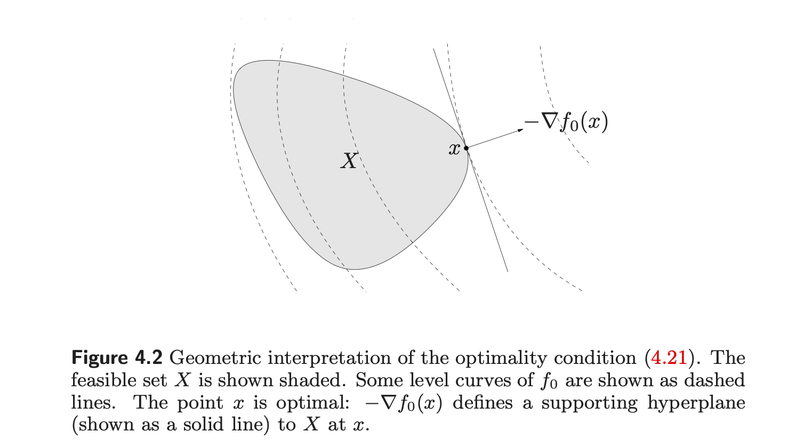


[Source](https://web.stanford.edu/~boyd/cvxbook/bv_cvxbook.pdf#page=83)

[Other Sources:](http://www.stat.cmu.edu/~ryantibs/convexopt-S15/lectures/03-convex-opt.pdf), [or](http://www.stat.cmu.edu/~ryantibs/convexopt-F15/scribes/03-convex-opt-scribed.pdf.)


---
class: middle
##Lagrange duality 

###Original optimization problem (simplified)

\begin{align}
&&\mbox{minimize}_{\mathbf{x} \in \mathbb{R}^p}f(\mathbf{x}) \\
&&\mbox{s.t} \phantom{11} g_j(\mathbf{x}) \leq \mathbf{0} \phantom{11} j=1,\ldots, m
\end{align}

###Form Lagrangian (using Lagrangian Multipliers)

$$L(\mathbf{x}; \lambda) = f(\mathbf{x}) + 
\sum_{j=1}^m \lambda_j g_j(\mathbf{x}).$$

- The nonnegative weights $\lambda \geq 0$ are known as Lagrange multipliers; the purpose of the multiplier $\lambda_j$ is to impose a penalty whenever the constraint $g_j(\boldsymbol{\beta}) \leq 0$ is violated. 

###Form Dual function

$$q(\lambda) = \mbox{inf}_{\mathbf{x}}\left\{ L(\mathbf{x}; \lambda) \right\}.$$


---
class: middle
##Lagrange duality


####Original problem 

$$\mbox{minimize}_{\mathbf{x}}\left[ \mbox{sup}_{\lambda \geq 0}L(\mathbf{x};\lambda) \right],$$

####Dual problem 

$$\mbox{maximize}_{\lambda \geq 0}\left[ \mbox{inf}_{x}L(\mathbf{x};\lambda) \right].$$


####Weak duality

If $\lambda \geq 0 \Rightarrow q(\lambda) \leq f(\mathbf{x}^{*}).$

\begin{align}
q(\lambda) =& \mbox{inf}_{x}L(\mathbf{x};\lambda)  \leq L(\mathbf{x}^{*};\lambda) \\
=& f(\mathbf{x}^{*}) + \sum_{j=1}^m \lambda_j g_j(\mathbf{x}) \leq f(\mathbf{x}^{*})
\end{align}

####Strong duality

$$q(\lambda) = f(\mathbf{x}^{*}).$$

[Supremum and Infimum:](https://www.youtube.com/watch?v=dIBtHsfUrIA); [Supremum and Infimum:](https://en.wikipedia.org/wiki/Infimum_and_supremum); [I recomend:](https://www.youtube.com/watch?v=u_vNrV14RXM)


---
class: middle

##Karish Kuhn Tucker Conditions

- For an **unconstrained convex optimization problem**, the necessary and sufficient conditions for **global minimum** is the **gradient is zero**. 

- The **Karish Kuhn Tucker (KKT) conditions** are the **equivalent conditions** for the **global minimum** of a **constrained convex optimization problem**.

- First we are going to study the KKT conditions when the strong duality holds.


---
class: middle
##Karish Kuhn Tucker Conditions - Strong Duality Holds

- If strong duality holds and $(\mathbf{x}^{*}, \lambda^{*})$ is optimal, then $\mathbf{x}^{*}$ minimize the problem 

$$\mbox{minimize}_{\mathbf{x}} f(\mathbf{x}) \phantom{11}
\mbox{such that} \phantom{11} g_j(\mathbf{x}) \leq 0, \phantom{11} \mbox{for} j = 1, \ldots, m,$$
giving the first KKT condition:


$$0 = \nabla L(\mathbf{x};\lambda) = \nabla f(\mathbf{x}^{*}) + \sum_{j=1}^m \lambda_j \nabla g_j(\mathbf{x}^{*}).$$


---
class: middle
##Lagrange Multipliers - Geometric Interpretation for 2D optimization problem

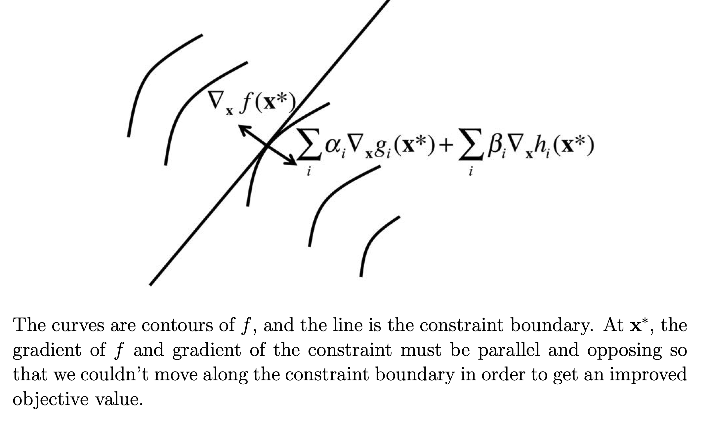


[Source:](https://ocw.mit.edu/courses/sloan-school-of-management/15-097-prediction-machine-learning-and-statistics-spring-2012/lecture-notes/MIT15_097S12_lec11.pdf)


---
class: middle
##Example of Dual Langrangian - Ridge Regression

Let's suppose the following model: $\mathbf{y} = \mathbf{X}\boldsymbol{\beta} +\boldsymbol{\epsilon}$ where $\mathbf{X}$ is the standardized matrix and consequently, we can estimate the remaining coefficients without intercept. 

The Penalized Sum Squared Error (Lagragian Form) is given by

$$SSE(\boldsymbol{\beta}) = (\mathbf{y} - \mathbf{X}\boldsymbol{\beta})^{'}(\mathbf{y} - \mathbf{X}\boldsymbol{\beta}) - \lambda \boldsymbol{\beta}^{'}\boldsymbol{\beta}$$

\begin{align}
SSE(\boldsymbol{\beta}) =& \mathbf{y}^{'}\mathbf{y} - 2\mathbf{X}^{'}\boldsymbol{\beta}^{'}\mathbf{y} + \boldsymbol{\beta}^{'}\mathbf{X}^{'}\mathbf{X}\boldsymbol{\beta} - \lambda\boldsymbol{\beta}^{'}\boldsymbol{\beta} \\
\frac{\partial SSE(\boldsymbol{\beta}) }{\partial \boldsymbol{\beta}} =& 2\mathbf{X}^{'}\mathbf{y} +2\mathbf{X}^{'}\mathbf{X}\boldsymbol{\beta} + 2\lambda\mathbf{I}\boldsymbol{\beta}
\end{align}

Making $\frac{\partial SSE(\boldsymbol{\beta}) }{\partial \boldsymbol{\beta}} = \mathbf{0}$, we have

\begin{align}
(\mathbf{X}^{'}\mathbf{X} + \lambda \mathbf{I})\boldsymbol{\beta} = \mathbf{X}^{'}\mathbf{y} \Rightarrow \hat{\boldsymbol{\beta}} =  (\mathbf{X}^{'}\mathbf{X} + \lambda \mathbf{I})^{-1}\mathbf{X}^{'}\mathbf{y}
\end{align}

---
class: middle

##KKT - Conditions

- Primal feasibility $g_j(\mathbf{x}^{*}) \leq 0, \phantom{11} \forall j$

- Complementary slackness $\lambda_jg_j(\mathbf{x}^{*}) = 0,\phantom{11} \forall j$

- Lagrangian condition $\nabla L(\mathbf{x}^{*}, \lambda^{*}) = 0.$


---
class: middle
##Non-differentiable Functions and Subgradients

- However, many optmization problems arising in statistics 
involve convex but non-differentiable cost functions.

- For example, the $l_1$ norm $g(\boldsymbol{\beta}) = \sum_{j=1}^p |\beta_j|$ is a convex function, but is not differentiable.

- For such problems the optimality conditions, in particular, the first-order condition and the Lagrangian condition  are not directly applicable.

- Since they involve gradients of the cost and constraint functions.


---
class: middle
##Non-differentiable Functions and Subgradients


- A basic property of differentiable convex functions is that the first order tangent approximation always provides a lower bound.

- The notion of subgradient is based on a natural generalization of this idea.

###Definition

The subgradient set, or subdifferential set $\partial f(x)$ of $f$ at $\mathbf{x}$ is

$$\partial f(\mathbf{x}) = 
\left\{ g: f(\mathbf{y}) \geq f(\mathbf{x}) + 
g^{'}(\mathbf{y} - \mathbf{x}) \phantom{11} \forall \mathbf{y}\right\}.$$

####Theorem 
$f: \mathbb{R}^n \Rightarrow \mathbb{R}$ is convex if and only if it has non-empty subdifferential set everywhere.

---
class: middle
##Subdifferential - Example


- For example, for $f(x) = |x|,$ we have

$$
\begin{align}
\partial f(x) = 
\left\{\begin{array}{cc} 
\left\{ +1 \right\} & \mbox{if} \phantom{11} x > 0  \\
\left\{ -1 \right\} & \mbox{if} \phantom{11} x < 0  \\
\left[ -1, 1 \right] & \mbox{if} \phantom{11} x = 0.  
\end{array}\right.
\end{align}
$$

Remember : $\frac{d |x|}{dx} = \frac{x}{|x|}$, for $x \neq 0.$


---
class: middle
##Subdifferential - Example


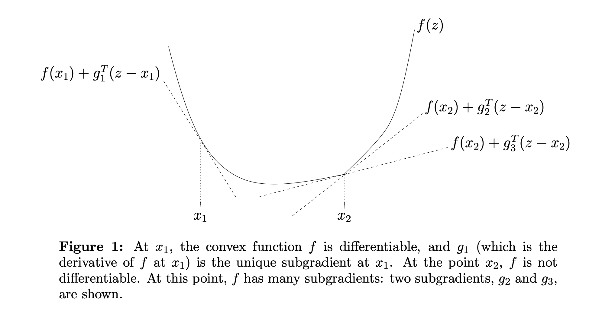


[Source](https://web.stanford.edu/~boyd/cvxbook/bv_cvxbook.pdf#page=83)


---
class: middle
##Subdifferential - Example


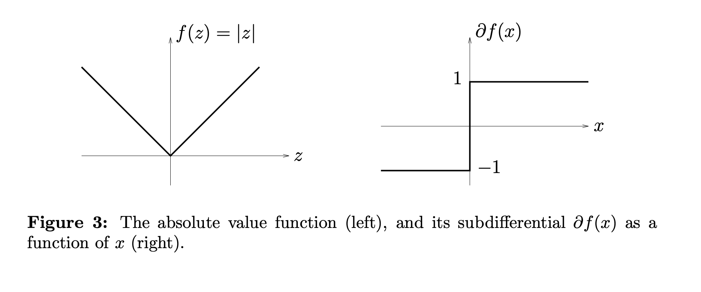


[Source](https://web.stanford.edu/~hastie/StatLearnSparsity/)

---
class: middle
##Subdifferential - How this is useful ?

- For convex optimization problem with one or more of the $\left\{f, g_j \right\}$ are convex but non-differentiable.

- In this case, the zero gradient Lagrangian condition no longer valid.

- However, under mild conditions, KKT conditions still can be applied

$$0 \in \partial f(\mathbf{x}^{*}) + \sum_{j=1}^m \lambda_j \partial g_j(\mathbf{x}^{*}).$$


---
class: middle
##Coordinate Descent

###Problem

Given a $f(\mathbf{x}) = g(\mathbf{x}) + \sum_{j=1}^m h_j(x_j)$ with $g$ convex differentiable and $h_i$ convex, if we are point $\mathbf{x}$ such that $f(\mathbf{x})$ is minimized along each coordinate axis, then have we found a global minimizer?

Answer: Yes!! (Proof, please see [Tseng (2001)](https://www.mit.edu/~dimitrib/PTseng/papers/archive/bcr_jota.pdf))


---
class: middle
##Coordinate Descent

The problem

$$\mbox{minimize}_{\mathbf{x}} f(\mathbf{x})$$
where $f(\mathbf{x}) = g(\mathbf{x}) + \sum_{j=1}^m h_j(x_j)$ with $g$ convex and differentiable and each 
$h_j$ convex, we can use **coordinate descent**:
let $x^{(0)} \in \mathbb{R}^{n},$ and repeat

$$x_j^{(k)} = \mbox{argmin}_{x_j} f(x_1^{(k)},
\ldots, x_{j-1}^{(k)}, x_j, x_{j+1}^{(k-1)}, 
\ldots, x_m^{(k-1)}), \phantom{111} \forall j$$
for $k = 1,2,3,\ldots,$

Important note: we always use **most recent information** possible.


[Source:](http://www.stat.cmu.edu/~ryantibs/convexopt/lectures/coord-desc.pdf)


---
class: middle
##Example of Coordinate Descent - Lasso Regression

$$\mbox{minimize} \frac{1}{2}||\mathbf{y} - \mathbf{X}\boldsymbol{\beta}||^{2}_{2} + \lambda||\boldsymbol{\beta}||$$
Minimizing over $\beta_j$:

$$0 = \mathbf{x}_j^{'}\mathbf{x}_j\beta_j + \mathbf{x}_j^{'}(\mathbf{X}_{-j}\boldsymbol{\beta}_{-j} - \mathbf{y}) + \lambda \partial|\beta_j|.$$
Solution is simply given by soft-thresholding

$$\hat{\beta}_j = S_{\lambda/||\mathbf{x}_j||^2_2}\left(\frac{\mathbf{x}_j^{'}(\mathbf{y}-\mathbf{X}_{-j}\boldsymbol{\beta}_{-j})}{\mathbf{x}_j\mathbf{x}_j}\right)$$

Repeat this for $i = 1, 2, \ldots, p,1,2, \ldots.$

[Source:](http://www.stat.cmu.edu/~ryantibs/convexopt/lectures/coord-desc.pdf)

---
class: middle
##Soft-thresholding - Lasso Regression


\begin{align}
0 = \left\{\begin{array}{cc} 
\mathbf{x}_j^{'}(\mathbf{X}_{-j}\boldsymbol{\beta}_{-j} - \mathbf{y}) + \mathbf{x}_j^{'}\mathbf{x}_j\beta_j - \lambda & \mbox{if} \phantom{11} \beta_j < 0 \\
[\mathbf{x}_j^{'}(\mathbf{X}_{-j}\boldsymbol{\beta}_{-j} - \mathbf{y}) - \lambda,
\mathbf{x}_j^{'}(\mathbf{X}_{-j}\boldsymbol{\beta}_{-j} - \mathbf{y})  + \lambda]
& \mbox{if} \phantom{11} \beta_j = 0. \\
\mathbf{x}_j^{'}(\mathbf{X}_{-j}\boldsymbol{\beta}_{-j} - \mathbf{y}) + \mathbf{x}_j^{'}\mathbf{x}_j\beta_j + \lambda
& \mbox{if} \phantom{11} \beta_j > 0
\end{array}\right.
\end{align}

We note that 

\begin{align}
0 &&\in [\mathbf{x}_j^{'}(\mathbf{X}_{-j}\boldsymbol{\beta}_{-j} - \mathbf{y})  - \lambda,
\mathbf{x}_j^{'}(\mathbf{X}_{-j}\boldsymbol{\beta}_{-j} - \mathbf{y})  + \lambda]
\Rightarrow \\
&&-\lambda \leq \mathbf{x}_j^{'}(\mathbf{X}_{-j}\boldsymbol{\beta}_{-j} - \mathbf{y}) \leq \lambda
\end{align}

Consequently,

\begin{align}
\hat{\beta_j} = \left\{\begin{array}{cc} 
\frac{\mathbf{x}_j^{'}(\mathbf{y}-\mathbf{X}_{-j}\boldsymbol{\beta}_{-j}) + \lambda}{\mathbf{x}_j^{'}\mathbf{x}_j} &
\mbox{if} \phantom{11} \mathbf{x}_j^{'}(\mathbf{X}_{-j}\boldsymbol{\beta}_{-j} - \mathbf{y}) < -\lambda \\
0 & \mbox{if} \phantom{11} -\lambda \leq \mathbf{x}_j^{'}(\mathbf{X}_{-j}\boldsymbol{\beta}_{-j} - \mathbf{y}) \leq \lambda \\
\frac{\mathbf{x}_j^{'}( \mathbf{y} - \mathbf{X}_{-j}\boldsymbol{\beta}_{-j} ) - \lambda}{\mathbf{x}_j^{'}\mathbf{x}_j} &
\mbox{if} \phantom{11} \mathbf{x}_j^{'}(  \mathbf{X}_{-j}\boldsymbol{\beta}_{-j} -\mathbf{y}) > \lambda
\end{array}\right.
\end{align}

[Other source:](https://xavierbourretsicotte.github.io/lasso_derivation.html)

---
class: middle
##Lasso Regression in R

```{r, warning = FALSE, message=FALSE, eval= FALSE}
library(tidyverse)
library(glmnet)
dat = read.table("http://statweb.stanford.edu/~tibs/ElemStatLearn/datasets/prostate.data")
# Getting the independent variable
nam = c( "lcavol",  "lweight", "age",     "lbph",    "svi",     "lcp",     "gleason","pgg45", "train" )
x_var <- as.matrix(select(dat,one_of(nam)))
# Getting the dependent variable
y_var = dat$lpsa 
# Using glmnet function to build the ridge regression in r
cvfit = cv.glmnet(x_var, y_var, alpha=1)
plot(cvfit)


```


---
class: middle
##Lasso Regression in R

```{r, warning = FALSE, message=FALSE, echo= FALSE}
library(tidyverse)
library(glmnet)
dat = read.table("http://statweb.stanford.edu/~tibs/ElemStatLearn/datasets/prostate.data")
# Getting the independent variable
nam = c( "lcavol",  "lweight", "age",     "lbph",    "svi",     "lcp",     "gleason","pgg45", "train" )
x_var <- as.matrix(select(dat,one_of(nam)))
# Getting the dependent variable
y_var = dat$lpsa 
# Using glmnet function to build the ridge regression in r
cvfit = cv.glmnet(x_var, y_var, alpha=1)
plot(cvfit)


```

---
####Results 

```{r}

coef(cvfit, s = "lambda.min")

```