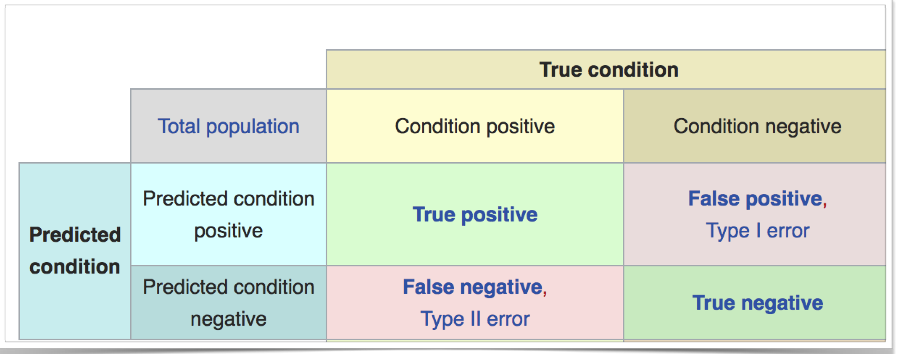
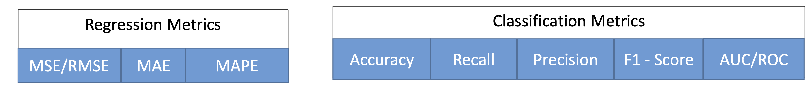
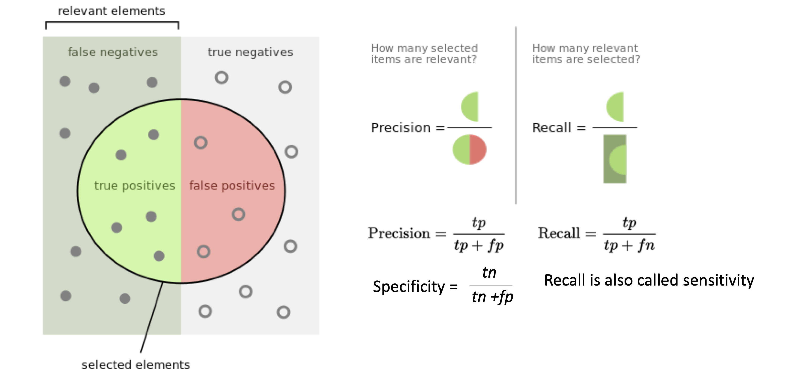
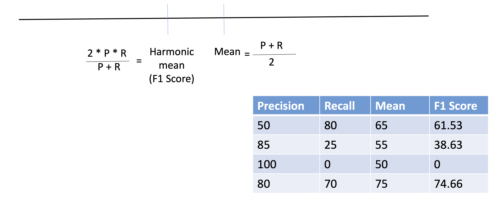
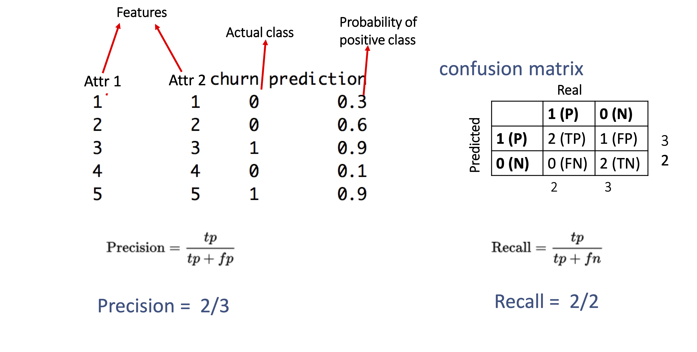
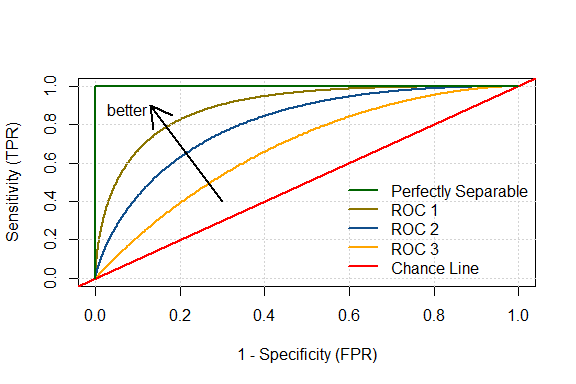
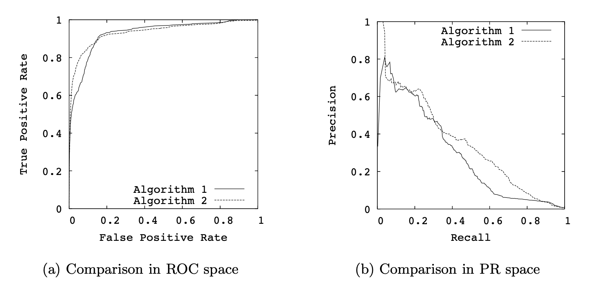

class: middle
##Regression Metrics

Let's suppose a testing set $\left\{(x_i, y_i\right\}_{n+1}^{N}$

- The Mean Squared Error is given by

$$\mbox{MSE}_{TST} = \frac{1}{N}\sum_{i=n+1}^{n+N}(y_i - \hat{f}(x_i))^2,$$

- The Root Mean Squared Error is given by

$$\mbox{RMSE}_{TST} = \sqrt{\frac{1}{N}\sum_{i=n+1}^{n+N}(y_i - \hat{f}(x_i))^2},$$

- The Mean Absolute Error 

$$\mbox{MAE}_{TST} = \frac{1}{N}\sum_{i=n+1}^{n+N}|y_i - \hat{f}(x_i)|,$$

---
class: middle
###Logistic Regression - Example 

- The data represent white males between 15 and 64, and the response variable is the presence or absence of myocardial infarction (MI) at the time of the survey

The variables

- sbp:  systolic blood pressure
- tobacco:  cumulative tobacco (kg)
- ldl:  low densiity lipoprotein cholesterol adiposity
- famhist:  family history of heart disease (Present, Absent)
- typea:  type-A behavior
- obesity:
- alcohol:  current alcohol consumption
- age: age at onset
- chd: response, coronary heart disease

---
class: middle
###Logistic Regression - Example 


```{r, warning = FALSE, message = FALSE,echo=FALSE}
library(tidyverse)
library(broom)
library(caret)
library(pROC)
library(ROCit)

dat = read.table("http://www-stat.stanford.edu/~tibs/ElemStatLearn/datasets/SAheart.data", sep=",",head=T,row.names=1)

mod_simple = glm(chd~ sbp + tobacco+ ldl+adiposity+famhist+typea+obesity+ alcohol+ age, data = dat, family=binomial(link="logit"))

tidy(mod_simple)

```

---
class: middle
###Interpretation of coefficients

Keeping all other predictors constant then,

- The odds ratio (OR) of getting heart diseases for an additional age
is $\exp\{0.0452\}=1.046237.$ An OR of 1.04 means there is a 4.7% increase in the odds of an outcome with a one year additional.

###Odds ratio  versus Risk Relative###

####Risk Relative (RR)
$$RR = \frac{P(sucess|exposed)}{P(sucess|unexposed)}$$

####Odds Ratio (OR)
$$OR = \frac{\frac{P(sucess|exposed)}{1-P(sucess|exposed)}}{\frac{P(sucess|unexposed)}{1- P(sucess|unexposed)}}.$$

[Source:](https://www2.stat.duke.edu/courses/Spring13/sta102.001/Lec/Lec21.pdf.)

---
class: middle

##Odds Ratio - Interpretation

- $\mbox{OR} > 1$ means greater odds of association with the exposure and outcome.

- $\mbox{OR} = 1$ means there is no association between exposure and outcome.

- $\mbox{OR} < 1$ means there is a lower odds of association between the exposure and outcome.

[Source:](https://journalfeed.org/article-a-day/2018/idiots-guide-to-odds-ratios.)

---
class: middle

##Prediction

- If we have a new value for variable $x$, how do we predict the $y$, 0 or 1?

###Prediction rule

- $Y = 1,$ if $pr(Y=y|\mathbf{X}=\mathbf{x})$ is greater than 0.5.
- $Y = 0,$ if $pr(Y=y|\mathbf{X}=\mathbf{x})$ is less than 0.5.

##Estimating the prediction error

- Prediction error is the probability of a wrong classification (0's predicted as 1's and 1's predicted as 0's).

- We can use cross-validation to estimate these proportions. 


---
class: middle

##Classification Metrics





---
class: middle

###Accuracy

$$\frac{TP+TN}{TP+FP+FN+TN}$$
where

- $TP$ is true positive;
- $TN$ is true negative;
- $FP$ is false positive;
- $FN$ is false negative.

####Is accuracy enough??? Accuracy of 99% is good???

Answer: It is depends on the context.

- Finding Fraud in a financial transaction.

- Spam versus Ham ('E-mail that is generally desired and isn't considered spam.').

- Imbalanced class.

[Source:](
https://courses.cs.ut.ee/MTAT.03.319/2019_spring/uploads/Main/Lect6-Evl_2019Spring_v3.pdf.)

---
class: middle

##Recall (Sensitivity), Precision and Specificity




[Source:](https://courses.cs.ut.ee/MTAT.03.319/2019_spring/uploads/Main/Lect6-Evl_2019Spring_v3.pdf.)

---
class: middle

##Harmonic mean (F1 score) of Precision and Recall better than mean (average)




---
class: middle

##Confusion Matrix 




[Multiclass Classification:](https://www.youtube.com/watch?v=6G5AAl42xp4)


---
class: middle

###Receiver Operating Characteristic (ROC) Curve 

- ROC curve is a plot of the true positive rate (TP) (y-axis)
vs. false positive rate (FP) (x-axis).

- True Positive Rate (TP) $= \frac{TP}{TP+FN}.$

- False Positive Rate (FP) $= \frac{FP}{TN+FP}.$

###Precision-Recall (PR) curves

- PR curve is a plot of the precision (y-axis) versus recall (x-axis)

###Area under curve (AUC)
- Definition: the AUC is the area under the ROC curve. 


- [Source 1:](https://www.alexejgossmann.com/auc/) 
- [Source 2:](https://datascienceplus.com/interpretation-of-the-auc/)

---
class: middle
##Area Under Curve (AUC)




---
class: middle

###Receiver Operating Characteristic (ROC) curve and Precision-Recall (PR) curve



[Good Explanation:](https://www.youtube.com/watch?v=4jRBRDbJemM)


---
class: middle
##Classification Metrics

```{r, warning = FALSE, message = FALSE, eval=FALSE}
set.seed(42)
dat_idx = sample(nrow(dat), round(0.7*nrow(dat)))
dat_trn = dat[dat_idx, ]
dat_tst = dat[-dat_idx, ]

model_glm = glm(chd~ sbp + tobacco+ ldl+adiposity+famhist+typea+obesity+ alcohol+ age,  data = dat_trn, family = binomial("logit"))

model_glm_pred = ifelse(predict(model_glm, type = "response", newdata=dat_tst) > 0.5, "1", "0")

train_tab = table(predicted = model_glm_pred, actual = as.character(dat_tst$chd))

train_con_mat = confusionMatrix(train_tab, positive = "1")

```

[Source 1:](https://daviddalpiaz.github.io/r4sl/logistic-regression.html#roc-curves)

[Source 2:](https://machinelearningmastery.com/difference-test-validation-datasets/)

[Source 3:](https://lgatto.github.io/IntroMachineLearningWithR/index.html)
---
class: middle


```{r, warning = FALSE, message = FALSE, echo=FALSE}
set.seed(42)
dat_idx = sample(nrow(dat), round(0.7*nrow(dat)))
dat_trn = dat[dat_idx, ]
dat_tst = dat[-dat_idx, ]

model_glm = glm(chd~ sbp + tobacco+ ldl+adiposity+famhist+typea+obesity+ alcohol+ age,  data = dat_trn, family = binomial("logit"))

model_glm_pred = ifelse(predict(model_glm, type = "response", newdata=dat_tst) > 0.5, "1", "0")

train_tab = table(predicted = model_glm_pred, actual = as.character(dat_tst$chd))

train_con_mat = confusionMatrix(train_tab, positive = "1")


```

####Confusion Matrix
```{r, warning = FALSE, message = FALSE, echo=FALSE}
train_con_mat$table
```

####Accuracy
```{r, warning = FALSE, message = FALSE, echo=FALSE}
train_con_mat$overall["Accuracy"]
```

####Overall
```{r, warning = FALSE, message = FALSE, echo=FALSE}
train_con_mat$byClass
```


---
class: middle
##ROC Curve

```{r, warning = FALSE, message = FALSE, eval=FALSE}

#Testing Data
test_prob = predict(model_glm, newdata = dat_tst, type = "response")
test_roc = roc(dat_tst$chd ~ test_prob, plot = TRUE, print.auc = TRUE)

#Training data
#test_prob = model_glm$fitted.value
#test_roc = roc(dat_trn$chd ~ test_prob, plot = TRUE, print.auc = TRUE)


```


---
class: middle
##ROC Curve -package 'pROC'

```{r, warning = FALSE, message = FALSE, echo=FALSE}


#Testing Data
test_prob = predict(model_glm, newdata = dat_tst, type = "response")
test_roc = roc(dat_tst$chd ~ test_prob, plot = TRUE, print.auc = TRUE)

#Training data
#test_prob = model_glm$fitted.value
#test_roc = roc(dat_trn$chd ~ test_prob, plot = TRUE, print.auc = TRUE)


```


---
class: middle
##ROC Curve - package 'pROC'

```{r, warning = FALSE, message = FALSE, eval=FALSE}

#Testing Data
score = predict(model_glm, type = "response",newdata = dat_tst) 
obs = dat_tst$chd
## Warning: package 'ROCit' was built under R version 3.5.2
ROCit_obj <- rocit(score=score,class=obs)
plot(ROCit_obj)


#Training Data
#score = model_glm$fitted.value
#obs = dat_tst$chd
#ROCit_obj <- rocit(score=score,class=obs)
#plot(ROCit_obj)

```


---
class: middle
##ROC Curve - package 'ROCit'

```{r, warning = FALSE, message = FALSE, echo=FALSE}

#Testing Data
score = predict(model_glm, type = "response",newdata = dat_tst) 
obs = dat_tst$chd
## Warning: package 'ROCit' was built under R version 3.5.2
ROCit_obj <- rocit(score=score,class=obs)
plot(ROCit_obj)


#Training Data
#score = model_glm$fitted.value
#obs = dat_trn$chd
#ROCit_obj <- rocit(score=score,class=obs)
#plot(ROCit_obj)

```


---
class middle
##Example 2 - Forest Fires


```{r, warning = FALSE, message = FALSE, eval=FALSE}
#Reading dataset
dat = read.csv("forestfires.csv", header = TRUE) %>%
  mutate(month = str_to_title(month)) %>%
  mutate(month = factor(month, levels = month.abb, ordered=TRUE)) %>%
  mutate(day = ordered(day, levels=c("mon","tue","wed","thu","fri", "sat","sun"))) %>%
  mutate(isBurned = as.numeric(area>0))

set.seed(42)
dat_idx = sample(nrow(dat), round(0.7*nrow(dat)))
dat_trn = dat[dat_idx, ]
dat_tst = dat[-dat_idx, ]


```


---
class middle
##Example 2 - Forest Fires

```{r,warning = FALSE, message = FALSE, eval=FALSE}

full.model = glm(isBurned~ 1 + Y + X + month  + day +
                                              FFMC + DMC+ 
                                              DC + ISI + temp +
                                              RH + wind + rain, data = dat_trn, family="binomial")


backward.model = MASS::stepAIC(full.model,
                               scope = list(upper = ~1 + Y +
                                              X + month  + day +
                                              FFMC + DMC+
                                              DC + ISI + temp +
                                              RH + wind + rain,  lower = ~1),
                              family="binomial",
                              direction="backward",trace = FALSE)

```


---
class middle
##Example 2 - Forest Fires

```{r,warning = FALSE, message = FALSE, eval=FALSE}

#Testing data
score2 = predict(backward.model, type = "response",newdata = dat_tst) 
obs2 = dat_tst$isBurned
## Warning: package 'ROCit' was built under R version 3.5.2
ROCit_obj2 <- rocit(score=score2,class=obs2)
plot(ROCit_obj2)


#Training data
#score2 = backward.model$fitted.values 
#obs2 = dat_trn$isBurned
## Warning: package 'ROCit' was built under R version 3.5.2
#ROCit_obj2 <- rocit(score=score2,class=obs2)
#plot(ROCit_obj2)


```


---
class middle
##Example 2 - Forest Fires


```{r, warning = FALSE, message = FALSE, echo=FALSE}
#Reading dataset
dat = read.csv("forestfires.csv", header = TRUE) %>%
  mutate(month = str_to_title(month)) %>%
  mutate(month = factor(month, levels = month.abb, ordered=TRUE)) %>%
  mutate(day = ordered(day, levels=c("mon","tue","wed","thu","fri", "sat","sun"))) %>%
  mutate(isBurned = as.numeric(area>0))

set.seed(42)
dat_idx = sample(nrow(dat), round(0.7*nrow(dat)))
dat_trn = dat[dat_idx, ]
dat_tst = dat[-dat_idx, ]

full.model = glm(isBurned~ 1 + Y + X + month  + day +
                                              FFMC + DMC+ 
                                              DC + ISI + temp +
                                              RH + wind + rain, data = dat_trn, family="binomial")


backward.model = MASS::stepAIC(full.model,
                               scope = list(upper = ~1 + Y +
                                              X + month  + day +
                                              FFMC + DMC+
                                              DC + ISI + temp +
                                              RH + wind + rain,  lower = ~1),
                              family="binomial",
                              direction="backward",trace = FALSE)

#Testing data
score2 = predict(backward.model, type = "response",newdata = dat_tst) 
obs2 = dat_tst$isBurned
## Warning: package 'ROCit' was built under R version 3.5.2
ROCit_obj2 <- rocit(score=score2,class=obs2)
plot(ROCit_obj2)

#Training data
#score2 = backward.model$fitted.values 
#obs2 = dat_trn$isBurned
## Warning: package 'ROCit' was built under R version 3.5.2
#ROCit_obj2 <- rocit(score=score2,class=obs2)
#plot(ROCit_obj2)

```


---
class middle
##Example 2 - Forest Fires

```{r,warning = FALSE, message = FALSE, eval=FALSE}

#Testing data
optimal_cutoff = ROCit_obj2$Cutoff[which.max(ROCit_obj2$TPR - ROCit_obj2$FPR)]
model_glm_pred= ifelse(predict(backward.model, type = "response",newdata=dat_tst) > optimal_cutoff, "1", "0")
train_tab = table(predicted = model_glm_pred, actual = as.character(dat_tst$isBurned))
train_con_mat = confusionMatrix(train_tab, positive = "1")


```

---
class: middle
##Example 2 - Forest Fires

####Confusion Matrix
```{r, warning = FALSE, message = FALSE, eval=FALSE}
train_con_mat$table
```

####Accuracy
```{r, warning = FALSE, message = FALSE, eval=FALSE}
train_con_mat$overall["Accuracy"]
```

####Overall
```{r, warning = FALSE, message = FALSE, eval=FALSE}
train_con_mat$byClass
```


---
class: middle
##Example 2 - Forest Fires

```{r,warning = FALSE, message = FALSE, echo =FALSE}

optimal_cutoff = ROCit_obj2$Cutoff[which.max(ROCit_obj2$TPR - ROCit_obj2$FPR)]
model_glm_pred= ifelse(predict(backward.model, type = "response",newdata=dat_tst) > optimal_cutoff, "1", "0")
train_tab = table(predicted = model_glm_pred, actual = as.character(dat_tst$isBurned))
train_con_mat = confusionMatrix(train_tab, positive = "1")


```

####Optimal cutoff = `r optimal_cutoff`


####Confusion Matrix 
```{r, warning = FALSE, message = FALSE, echo =FALSE}
train_con_mat$table
```

####Accuracy = `r train_con_mat$overall["Accuracy"]`


####Overall
```{r, warning = FALSE, message = FALSE, echo=FALSE}
train_con_mat$byClass
```
