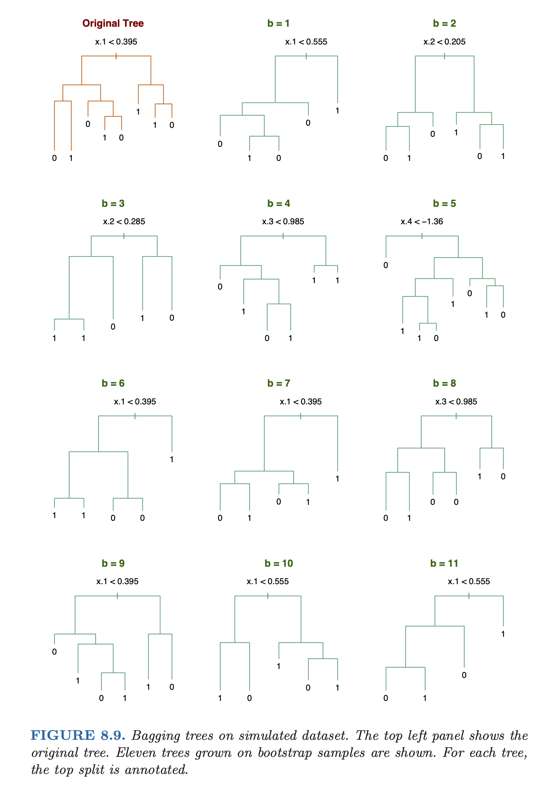

class: middle

##Review: Classification trees

- Our task is to predict the class label given 
a feature vector.

- Classification trees divide the feature space $\mathbb{R}^p$ up into several rectangles, and then 
assign to each rectangle $R_j$ a particular class $c_j.$

$$\hat{f}^{\mbox{tree}} = \sum_{j=1}^m c_j 
I(x \in R_j) = c_j \phantom{11} \mbox{such that}
x \in R_j.$$

- Given training data $(x_i, y_i), i = 1, \ldots, n$ with $y_i \in \left\{1, \ldots, K \right\}$ being the class label and $x_j \in \mathbb{R}^p$ the associated 
feature vector, the CART algorithm sucessively splits 
the features in a greedy fashion.

- In strategy is to grow a large tree and then prune
back using cross-validation. 

---
class: middle

##Review: Classification trees


- At the end, in each rectangle $R_j$ the predicted class is simply the majority class:

$$c_j = \mbox{arg max}_{k = 1,\ldots,K}\hat{p}_k (R_j),$$
where $\hat{p}_k(R_j)$ is the proportion of points of class $k$ that fall into region $R_j$

$$\hat{p}_k(R_j) = \frac{1}{n_j}\sum_{x \in R_j}I(y_i = k).$$

- This gives us predicted class probabilities for each region.


---
class: middle

##Limitations of Trees

- One major problem of classification and regression trees are their high variance, mainly due to the hierarchical nature of the process.

  - Small change in data may result in a very different series of splits, making interpretations somewhat precautious.
  
  - The effect of an error in the top split is propagated down to all the splits below it.

---
class: middle

##Bootstrap 

- The **bootstrap** is a resampling method in statistics.

- The basic ideia underlying the bootstrap is that we can estimate the true probability distribution by the empirical distribution.

- A **bootstrap sample** of size $m$ from the training data is 

$$(x_i^{*}, y_i^{*}), \phantom{11} i = 1, \ldots, m.$$
where each $(x_i^{*}, y_i^{*})$ are drawn from uniformily at random from $(x_1^{*}, y_1^{*}), \ldots, (x_m^{*}, y_m^{*}),$ with replacement.

- This corresponds exactly to $m$ independent draws from $\hat{F}.$

- Note: **not all** of the training points are **represented** in a bootstrap sample, and some are represented more than once.

- About 36,8% of points are left out, for large $n$.


---
class: middle

##Bagging


- Bagging stands for ”Boostrap Aggregation” and is a variance reduction ensembling method.

- Given a training data $(x_i, y_i), \phantom{1} i = 1, \ldots, n$ bagging averages the predictions from classification trees over a collection of boostrap
samples.

- We draw $B$ bootstrap samples and fit a classification tree for each one of them.

- At the end, to classify and input
$x \in \mathbb{R}^p,$ we simply take the most 
commonly predicted class:

$$\hat{f}^{\mbox{bag}}(x) = \mbox{argmax}_{k=1, \ldots, K} \sum_{b=1}^B I(\hat{f}^{\mbox{tree}}(x) = k).$$

This is just choosing the class with the **most votes**. 


---
class: middle

##Bagging

###Voting: Two options

-  Simple strategy: grow fairly large trees on each sampled data set, with no pruning.

- More involved strategy: prune back each tree as we do with CART, but use the original training data $(x_i, y_i), i = 1, \ldots, n$ as the validation set, instead of performing cross-validation.


---
class: middle

##Bagging - Example




---
class: middle

##Alternative form of bagging 

- Now given and input $x \in \mathbb{R}^p,$
instead of simply taking the prediction
$\hat{f}^{\mbox{tree}, b}(x)$ from each tree

- We go further and look at its predicted class
probabilities $\hat{p}^{\mbox{tree},b}(x), k = 1, \ldots, K.$ 

- We then define the bagging estimates of class
probabilities:

$$\hat{p}_k^{\mbox{bag}}(x) = \frac{1}{B}
\sum_{b=1}^B \hat{p}_k^{\mbox{tree},b}(x), 
\phantom{11} k=1,\ldots,K.$$

- The final bagged just chooses the class with the highest probability

$$\hat{f}^{\mbox{bag}}(x) = \mbox{argmax}_{k=1, \ldots, K} \hat{p}_k^{\mbox{bag}}(x) .$$
- This form of bagging is preferred if it is desired
to get estimates of the class probabilities.

- Also, it can sometimes help the overall prediction accuracy.

---
class: middle

##Why Does Bagging works? (“wisdom of the crowd”)

- The general idea behind bagging is referred to as the “wisdom of the crowd” effect and was popularized by Surowiecki (2005). 

- It  means that the aggregation of information in large diverse groups results in decisions that are often better than could have been made by any single member of the group. 

- The more diverse the group members are then the more diverse their perspectives and predictions will be, which often leads to better aggregated information.

[Source:](https://bradleyboehmke.github.io/HOML/bagging.html)

---
classe: middle

##Bagging - R code


```{r, warning=FALSE, message=FALSE, echo = FALSE}

library(tidyverse)
library(rpart)
library(caret)       
library(ipred) 
library(pROC)
library(ROCit)


#Dataset
dat = mutate(stagec, pgstat = factor(pgstat) )
dat$eet[is.na(dat$eet)] = median(dat$eet, na.rm=TRUE)
dat$g2[is.na(dat$g2)]= median(dat$g2, na.rm=TRUE)
dat$gleason[is.na(dat$gleason)]= median(dat$gleason, na.rm=TRUE)

set.seed(42)
dat_idx = sample(nrow(dat), round(0.7*nrow(dat)))
dat_trn = dat[dat_idx, ]
dat_tst = dat[-dat_idx, ]


trCtrl <- trainControl(method = "cv", number = 10)
cr.fit <- train(pgstat~., data = dat_trn, method = "treebag",
               trControl = trCtrl, metric = "Accuracy")
 
print(cr.fit)

```


---
class: middle

##ROC curve

```{r, warning=TRUE, message=TRUE, echo = FALSE}
#Testing data
score = predict(cr.fit, newdata = dat_tst,type="prob")[,2]
obs = dat_tst$pgstat
## Warning: package 'ROCit' was built under R version 3.5.2
ROCit_obj <- rocit(score=score,class=obs)
plot(ROCit_obj)

#Testing data
optimal_cutoff = ROCit_obj$Cutoff[which.max(ROCit_obj$TPR - ROCit_obj$FPR)]
model_bag_pred= ifelse(predict(cr.fit, newdata=dat_tst,type="prob")[,2] > optimal_cutoff, "1", "0")
train_tab = table(predicted = model_bag_pred, actual = as.character(dat_tst$pgstat))
train_con_mat = confusionMatrix(train_tab, positive = "1")


```


---
class: middle
##Example 

####Confusion Matrix
```{r, warning = FALSE, message = FALSE, echo=FALSE}
train_con_mat$table
```

####Accuracy
```{r, warning = FALSE, message = FALSE, echo=FALSE}
train_con_mat$overall["Accuracy"]
```

####Overall
```{r, warning = FALSE, message = FALSE, echo=FALSE}
train_con_mat$byClass
```
