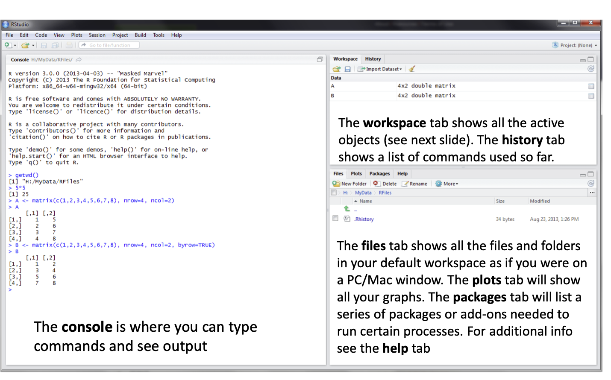
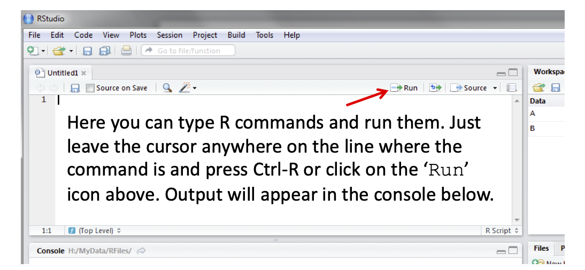
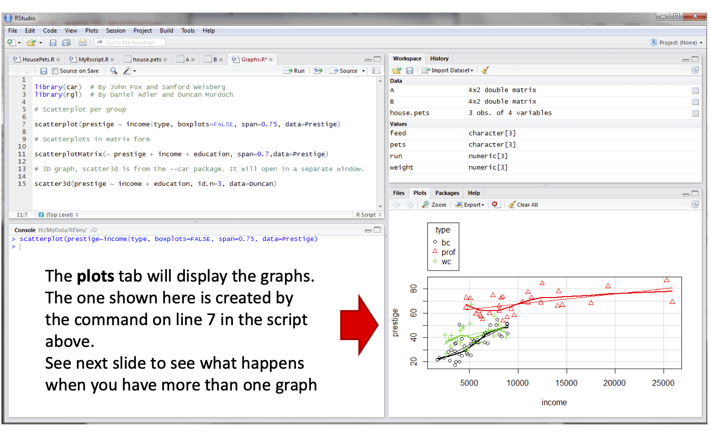

##R and RStudio

* R is a programming language; 
* RStudio is a IDE (Integrated Development Environment).

  
---
class: inverse, center, middle
#RStudio
   
---
   
##Source: [sthda](http://www.sthda.com/english/wiki/r-basics-quick-and-easy)      
---


##Source: Oscar Torres Reyas (2013)

---


##Source: Oscar Torres Reyas (2013)

---


##Source: Oscar Torres Reyas (2013)

---
class: inverse, center, middle
#R Basics

---
#Basic arithmetic operations: 


```{r, echo=TRUE}
#addition
1 + 1 
#subtraction
3 - 2 
#multiplication
2 * 2
#division
4 / 2
```

---
#Basic arithmetic operations: 

```{r, echo=TRUE}
#Exponentiation  "b raised to the n-th power"
10^2
#Square Root 
sqrt(100); 100^(1/2)
#Logarithm "The logarithm of 100 to base 10"
log10(100)
#Natural logarithm 
log(100) 
#Exponential function
exp(100)

```


---
#Basic arithmetic operations:

```{r}

#Note that
(-2)^3; (-8)^(1/3)


#Modulo operation - Remainder of the Euclidean division
5 %% 3 

```


---
#Basic arithmetic operations:


```{r}
#Absolute values
abs(-4)

#Absolute values
abs(4)

```


---
#Basic arithmetic operations:

```{r}

#cosine
cos(90); cos(pi/2)

#sine
sin(90); sin(pi/2)

#tangent
tan(45); tan(pi/4)


```

---
#Basic data types: numeric, character and logical


```{r}
my_age = 37 # Numeric variable

my_age

my_name = "Renato" # Character variable

my_name

#  Are you a data scientist?: (yes/no) <=> (TRUE/FALSE)
is_datascientist = TRUE # logical variable

```

---

#Vectors: a combination of multiple values (numeric, character or logical)


```{r}

friend_ages = c(27, 25, 29, 26)

mean(friend_ages)

max(friend_ages) 

```

---

#Matrices: 

- A matrix contains multiple rows and columns. Combination of multiple vectors with the same types (numeric, character or logical).


```{r}

matrix(1:9,3,3)

matrix(1:9, 3,3, byrow = TRUE)

```

---
#Matrices:

```{r}

A = matrix(1:9,3,3, byrow = TRUE)

A; A[1,2]; A[1,]; A[,2]; A[c(1,3),];  A[c(1,3),c(2,3)];


```


---


#Matrices: 

.pull-left[
```{r,  echo = TRUE}
A = matrix(1:9,3,3)

B = matrix(c(1,3,4,5,6,7,9,12,20),3,3)

A; B

```
]
.pull-right[
```{r, echo = TRUE}

 A + B; A * 5
```
]


---

#Matrices:

.pull-left[
```{r,  echo = TRUE}

A = matrix(1:9,3,3)

B = matrix(c(1,3,4,5,6,7,9,12,20),3,3)

A; B

```
]
.pull-right[
```{r, echo = TRUE}

 A * B; A %*% B
```
]


